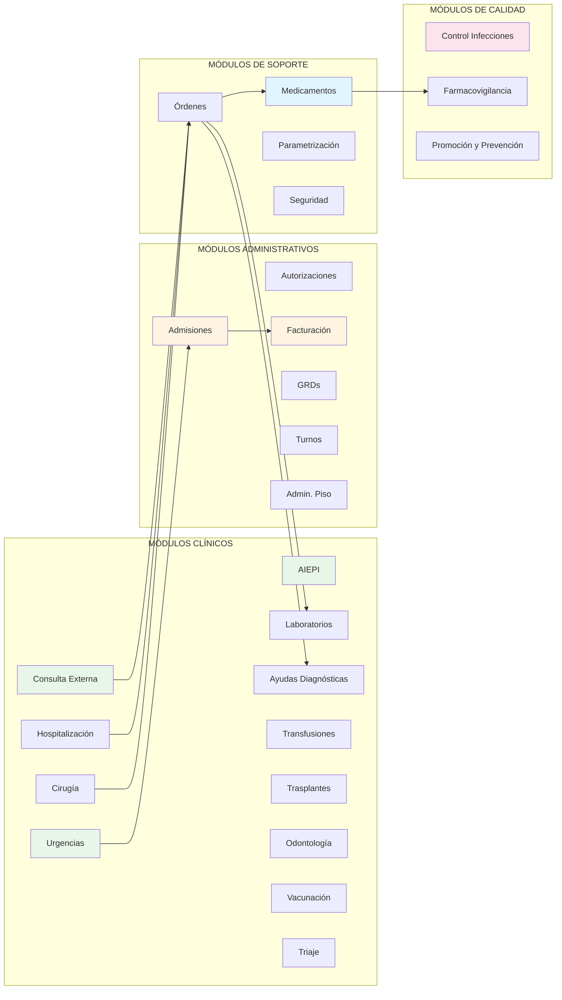
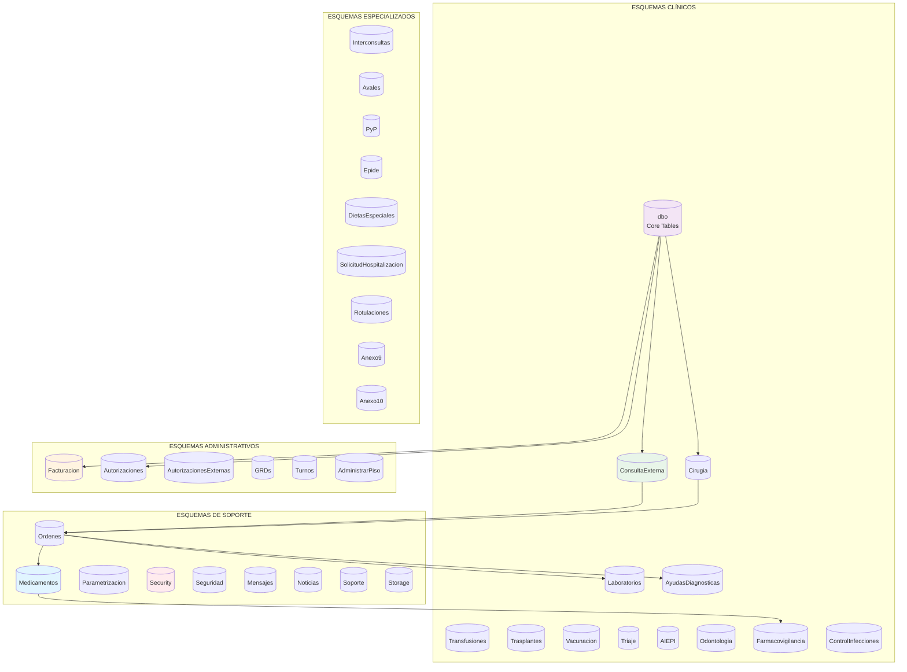
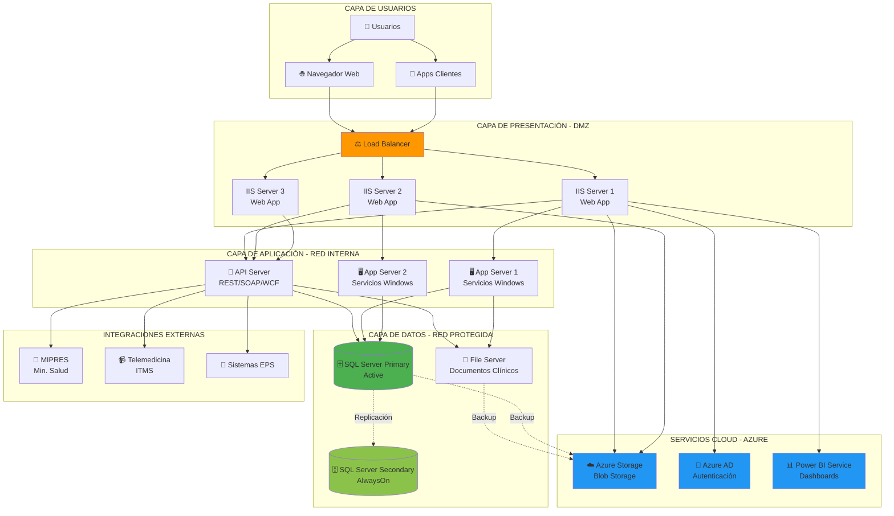
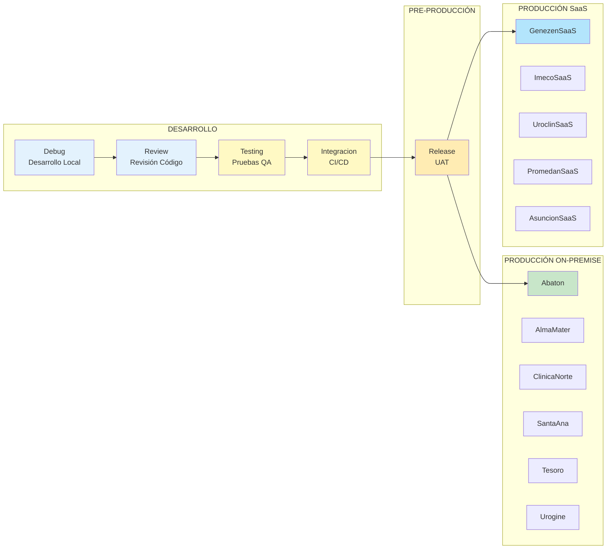
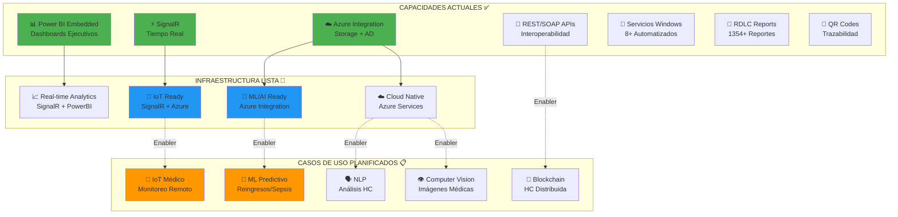
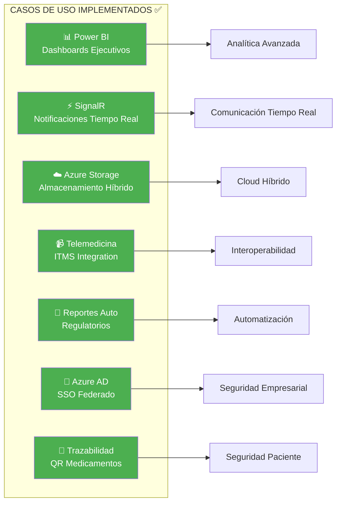

# DOCUMENTACIÓN ARQUITECTÓNICA - SISTEMA EMR GHIPS
## Respuestas a Preguntas de Arquitectura de Solución

**Fecha:** 10 de noviembre de 2025  
**Sistema:** GHIPS - Gestión Hospitalaria Integral de Procesos de Salud  
**Tipo:** Electronic Medical Record (EMR) / Sistema de Información Hospitalaria

---
 
> Desarrollado por el GRUPO DESARROLLO GHIPS. GHIPS es una marca registrada. © 2025 GRUPO DESARROLLO GHIPS. Todos los derechos reservados.

## 1. ARQUITECTURA Y COMPONENTES DE APLICACIÓN DEL EMR

### 1.1 Diagrama de Arquitectura General

```mermaid
graph TB
    subgraph "CAPA DE PRESENTACIÓN"
        Web[Ips.Gestion.Ghips.Web<br/>ASP.NET WebForms]
        WebLocal[Ips.Gestion.Ghips.WebLocal<br/>Aplicación Interna]
        Presentacion[libGHIPS.Presentacion<br/>Componentes UI]
    end

    subgraph "CAPA DE SERVICIOS"
        ServiciosApi[Ips.Gestion.Ghips.ServiciosApis<br/>REST APIs]
        ServiciosWcf[Ips.Gestion.Ghips.Services.Wcf<br/>WCF Services]
        ServiciosWs[Ips.Gestion.Ghips.Services.Ws<br/>SOAP Web Services]
    end

    subgraph "CAPA DE LÓGICA DE NEGOCIO"
        Core[Ips.Gestion.Ghips.Core<br/>Núcleo de Negocio]
        Logica[libGHIPS.Logica<br/>Lógica Legacy]
        Domain[Ips.Gestion.Ghips.Domain<br/>Modelos de Dominio]
        DomainTO[Ips.Gestion.Ghips.Domain.To<br/>Transfer Objects]
    end

    subgraph "CAPA DE INFRAESTRUCTURA"
        Infrastructure[Ips.Gestion.Ghips.Infrastructure<br/>Servicios Técnicos]
        Security[Ips.Gestion.Ghips.Security<br/>Autenticación y Autorización]
        Connect[Ips.Gestion.Ghips.Connect<br/>Interoperabilidad]
        LibBD[LibBD<br/>Acceso a Datos]
    end

    subgraph "CAPA DE DATOS"
        BaseDatos[(Ips.Gestion.Ghips.BaseDatos<br/>SQL Server<br/>42+ Esquemas)]
    end

    subgraph "SERVICIOS WINDOWS"
        SvcGhips[ServiceGhips<br/>Servicio Principal]
        SvcTraz[Trazabilidad]
        SvcMail[SendMail]
        SvcMed[EnvioMedicamentos]
        SvcOrd[EnvioOrdenes]
        SvcHC[EnvioHistoriaClinica]
        SvcFin[EnvioInfoFinanciero]
        SvcGer[EnvioInfoGerencial]
    end

    subgraph "INTEGRACIONES EXTERNAS"
        Azure[Azure Storage<br/>Azure AD]
        PowerBI[Power BI<br/>Embedded]
        Telemedicina[Telemedicina<br/>ITMS Service]
        MIPRES[MIPRES<br/>Min. Salud]
    end

    Web --> ServiciosApi
    Web --> ServiciosWcf
    WebLocal --> ServiciosWs
    
    ServiciosApi --> Core
    ServiciosWcf --> Core
    ServiciosWs --> Core
    
    Core --> Domain
    Core --> Infrastructure
    Logica --> Infrastructure
    
    Infrastructure --> Security
    Infrastructure --> Connect
    Infrastructure --> LibBD
    
    LibBD --> BaseDatos
    
    SvcGhips --> Core
    SvcTraz --> Core
    SvcMail --> Core
    SvcMed --> Core
    SvcOrd --> Core
    SvcHC --> Core
    SvcFin --> Core
    SvcGer --> Core
    
    Web --> PowerBI
    Connect --> Azure
    Connect --> Telemedicina
    Connect --> MIPRES
    Security --> Azure

    style Web fill:#e1f5ff
    style WebLocal fill:#e1f5ff
    style ServiciosApi fill:#fff4e1
    style ServiciosWcf fill:#fff4e1
    style Core fill:#e8f5e9
    style BaseDatos fill:#f3e5f5
    style Azure fill:#e3f2fd
    style PowerBI fill:#e3f2fd
```



### 1.2 Arquitectura General
El sistema GHIPS implementa una **arquitectura multicapa (N-Tier)** con los siguientes componentes principales:

#### **Capa de Presentación**
- **Ips.Gestion.Ghips.Web** - Aplicación web principal (ASP.NET WebForms)
- **Ips.Gestion.Ghips.WebLocal** - Aplicación web local/interna
- **libGHIPS.Presentacion** - Biblioteca de componentes de presentación compartidos

#### **Capa de Lógica de Negocio**
- **Ips.Gestion.Ghips.Core** - Núcleo de lógica de negocio
- **libGHIPS.Logica** - Lógica de negocio legacy
- **libGHIPS.Logica.Config** - Configuraciones y parámetros de negocio
- **Ips.Gestion.Ghips.Domain** - Modelos de dominio
- **Ips.Gestion.Ghips.Domain.To** - Transfer Objects (DTOs)

#### **Capa de Servicios**
- **Ips.Gestion.Ghips.Services.Wcf** - Servicios WCF
- **Ips.Gestion.Ghips.Services.Ws** - Web Services SOAP/ASMX
- **Ips.Gestion.Ghips.ServiciosApis** - APIs REST (ASP.NET Web API)

#### **Capa de Integración e Interoperabilidad**
- **Ips.Gestion.Ghips.Connect** - Conectores de interoperabilidad
- **Módulos de integración** para sistemas externos (MIPRES, HL7, etc.)

#### **Capa de Infraestructura**
- **Ips.Gestion.Ghips.Infrastructure** - Servicios de infraestructura
- **Ips.Gestion.Ghips.Security** - Seguridad y autenticación
- **LibBD** (Ips.Gestion.Ghips.libBD) - Acceso a datos

#### **Capa de Datos**
- **Ips.Gestion.Ghips.BaseDatos** - Proyecto SQL Server Database con esquemas especializados

### 1.2 Diagrama de Módulos Funcionales



### 1.3 Módulos Funcionales Principales

El sistema está organizado en **42+ módulos funcionales especializados**, identificados en la estructura de base de datos:

**Módulos Clínicos:**
- AIEPI (Atención Integral de Enfermedades Prevalentes de la Infancia)
- Consulta Externa
- Urgencias
- Hospitalización
- Cirugía
- Odontología
- Laboratorios
- Ayudas Diagnósticas
- Transfusiones
- Trasplantes
- Vacunación
- Triaje
- Control de Infecciones
- Farmacovigilancia

**Módulos Administrativos:**
- Admisiones
- Autorizaciones
- Autorizaciones Externas
- Facturación
- GRDs (Grupos Relacionados de Diagnóstico)
- Turnos
- Administración de Piso

**Módulos de Soporte:**
- Medicamentos
- Ordenes
- Avales
- Parametrización
- Seguridad
- Mensajes
- Noticias

### 1.3 Servicios Windows
- **Ips.Gestion.Ghips.Win.ServiceGhips** - Servicio principal
- **Ips.Gestion.Ghips.ServicioWinTrazabilidad** - Trazabilidad
- **Ips.Gestion.Ghips.Win.EnvioMedicamentos** - Envío de medicamentos
- **Ips.Gestion.Ghips.Win.EnvioOrdenes** - Envío de órdenes
- **Ips.Gestion.Ghips.Win.SendMail** - Notificaciones por correo
- **Ips.Gestion.Ghips.Win.EnvioHistoriaClinica** - Envío de HC
- **Ips.Gestion.Ghips.Win.EnvioInfoFinanciero** - Información financiera
- **Ips.Gestion.Ghips.Win.EnviarInfoGerencial** - Información gerencial

---

## 2. DOCUMENTACIÓN TÉCNICA DE LA SOLUCIÓN

### 2.1 Arquitectura Técnica
- **Patrón arquitectónico:** N-Tier (Multicapa) con separación de responsabilidades
- **Estilo arquitectónico:** Service-Oriented Architecture (SOA)
- **Inyección de dependencias:** Microsoft Unity Container (v5.11.7)
- **Patrones de diseño implementados:**
  - Repository Pattern (acceso a datos)
  - Service Layer Pattern
  - Transfer Object Pattern (DTOs)
  - Factory Pattern
  - Dependency Injection

### 2.2 Estructura de la Solución
La solución contiene **40+ proyectos** organizados en carpetas lógicas:
- **Presentacion** - Proyectos de interfaz de usuario
- **Logica** - Lógica de negocio
- **Interfaces** - Contratos y abstracciones
- **Dominio** - Modelos y entidades
- **Infraestructura** - Servicios técnicos
- **Servicios** - Capa de servicios
- **Almacenamiento** - Base de datos
- **Interoperabilidad** - Integraciones externas
- **Pruebas** - Proyectos de testing

### 2.3 Gestión de Configuración por Ambiente
El sistema soporta **múltiples configuraciones de despliegue** (14+ ambientes):
- Debug / Release / Review / Testing / Integracion
- Ambientes específicos de clientes (SaaS): GenezenSaaS, ImecoSaaS, UroclinSaaS, PromedanSaaS, AsuncionSaaS
- Ambientes productivos por institución: Abaton, AlmaMater, ClinicaNorte, SantaAna, Tesoro, Urogine

---

## 3. ESPECIFICACIÓN DE FRAMEWORKS, LENGUAJES Y LIBRERÍAS UTILIZADAS

### 3.1 Lenguajes de Programación
- **C# (.NET Framework 4.5.2 - 4.6.1)** - Lenguaje principal
- **JavaScript / jQuery (1.10.2)** - Frontend interactivo
- **Knockout.js (3.2.0)** - MVVM en cliente
- **SQL / T-SQL** - Base de datos
- **HTML5 / CSS3** - Presentación web

### 3.2 Frameworks y Plataformas

#### **Backend .NET**
- **ASP.NET WebForms** - Framework de aplicación web principal
- **ASP.NET Web API** - Servicios REST
- **WCF (Windows Communication Foundation)** - Servicios SOAP
- **Entity Framework** (implícito en referencias)
- **Microsoft Enterprise Library 5.0.414.0:**
  - Logging
  - Caching
  - Data Access

#### **Frontend**
- **AJAX Control Toolkit (17.1.0.0)** - Controles web avanzados
- **Kendo UI Web (2014.1.318)** - Componentes UI ricos
- **jQuery UI (1.11.1)** - Interfaz de usuario
- **jQuery Validation (1.13.0)** - Validaciones cliente
- **Knockout.js (3.2.0)** - Data binding MVVM
- **Knockout-Kendo (0.8.1)** - Integración KO-Kendo
- **Chart.js (3.7.1)** - Gráficos y visualizaciones
- **Bootstrap (3.2.0.1)** - Framework CSS responsivo
- **Modernizr (2.8.3)** - Detección de características
- **Chosen (1.2.0)** - Select mejorados

### 3.3 Librerías y Componentes Principales

#### **Generación de Documentos**
- **EPPlus (7.0.10)** - Generación de Excel (OpenXML)
- **ClosedXML (0.95.4)** - Manipulación de Excel
- **iTextSharp (4.1.2)** - Generación de PDF
- **Select.Pdf (18.3.0)** - Conversión HTML a PDF
- **PDFsharp-MigraDoc-gdi (1.50.5147)** - Generación de documentos PDF
- **DocumentFormat.OpenXml (2.16.0)** - Manipulación de Office

#### **Comunicación y APIs**
- **SignalR (2.2.2 / 2.4.3)** - Comunicación en tiempo real
- **RestSharp (106.11.7)** - Cliente HTTP REST
- **Newtonsoft.Json (10.0.2)** - Serialización JSON
- **Microsoft OWIN (4.0.1)** - Middleware web

#### **Azure y Cloud**
- **WindowsAzure.Storage (2.1.0.3)** - Azure Storage
- **Microsoft.WindowsAzure.ConfigurationManager (1.8.0.0)** - Configuración Azure
- **Microsoft.Data.OData (5.2.0)** - Protocolo OData
- **Microsoft.IdentityModel.Clients.ActiveDirectory (2.28.4)** - Azure AD

#### **Utilidades**
- **AutoMapper (4.1.1)** - Mapeo de objetos
- **QRCoder (1.4.1)** - Generación de códigos QR
- **HtmlAgilityPack (1.4.9.5)** - Parsing HTML
- **Ionic.Zip** - Compresión de archivos

### 3.4 Herramientas de Desarrollo
- **Visual Studio 2016** (ToolsVersion 12.0-15.0)
- **SQL Server Data Tools (SSDT)** - Desarrollo de BD
- **NuGet Package Manager** - Gestión de dependencias
- **Source Control** - Sistema de control de versiones configurado

---

## 4. ARQUITECTURA Y MODELO DE DATOS

### 4.1 Diagrama del Modelo de Datos



### 4.2 Motor de Base de Datos
- **Microsoft SQL Server** (2012+)
- **Provider:** SQL_Latin1_General_CP1_CI_AS (Collation)
- **Esquema:** Microsoft.Data.Tools.Schema.Sql.Sql120DatabaseSchemaProvider

### 4.2 Organización del Modelo de Datos

El modelo de datos está organizado en **esquemas especializados** (42+ esquemas identificados):

#### **Esquemas Clínicos**
- **dbo** - Tablas core del sistema
- **ConsultaExterna** - Consulta ambulatoria
- **Cirugia** - Procedimientos quirúrgicos
- **Laboratorios** - Exámenes de laboratorio
- **AyudasDiagnosticas** - Imagenología y diagnósticos
- **Transfusiones** - Banco de sangre
- **Trasplantes** - Gestión de trasplantes
- **Vacunacion** - Control de vacunas
- **Triaje** - Clasificación de urgencias
- **AIEPI** - Atención pediátrica
- **Odontologia** - Servicios odontológicos
- **Farmacovigilancia** - Vigilancia farmacológica
- **ControlInfecciones** - IAAS y epidemiología

#### **Esquemas Administrativos**
- **Facturacion** - Facturación y cobro
- **Autorizaciones** - Autorizaciones internas
- **AutorizacionesExternas** - Autorizaciones EPS
- **GRDs** - Grupos relacionados de diagnóstico
- **Turnos** - Gestión de turnos médicos
- **AdministrarPiso** - Administración hospitalaria

#### **Esquemas de Soporte**
- **Medicamentos** - Farmacia
- **Ordenes** - Órdenes médicas
- **Parametrizacion** - Configuración del sistema
- **Security** - Seguridad y permisos
- **Seguridad** - Auditoría de seguridad
- **Mensajes** - Mensajería interna
- **Noticias** - Notificaciones
- **Soporte** - Soporte técnico
- **Storage** - Almacenamiento de archivos

#### **Esquemas Especializados**
- **Interconsultas** - Interconsultas médicas
- **Avales** - Avales médicos
- **PyP** - Promoción y Prevención
- **Epide** - Epidemiología
- **Furtran** - FURTRAN
- **DietasEspeciales** - Nutrición clínica
- **SolicitudHospitalizacion** - Gestión de camas
- **SoportesPDF** - Documentos PDF
- **Rotulaciones** - Rotulado de muestras
- **Anexo9, Anexo10** - Formatos regulatorios

### 4.3 Estrategia de Datos
- **Enfoque:** Database-first con proyecto SQL Server Database
- **Normalización:** Diseño normalizado por esquemas funcionales
- **Auditoría:** Microsoft Enterprise Library Logging Database
- **Configuración:** dataConfiguration con múltiples connection strings
- **Caché:** Enterprise Library Caching para optimización

### 4.4 Acceso a Datos
- **Patrón:** Repository Pattern
- **Tecnología:** ADO.NET + Enterprise Library Data Access
- **ORM complementario:** Probable uso de Entity Framework (referencias indirectas)
- **Transacciones:** Gestión de transacciones distribuidas
- **Connection Pooling:** Max pool size configurado (200 conexiones)

---

## 5. HERRAMIENTAS O MÓDULOS DE ANALÍTICA INCLUIDOS

### 5.1 Business Intelligence y Dashboards

#### **Power BI Embedded**
El sistema integra **Microsoft Power BI** para análisis y visualización:
- **Librería:** powerbi.js (SDK de Power BI)
- **Capacidades:**
  - Dashboards embebidos en la aplicación web
  - Reportes interactivos
  - Visualizaciones dinámicas
  - Integración con modelo de datos

#### **Componentes de Visualización**
- **Chart.js (3.7.1)** - Gráficos y métricas visuales
- **Kendo UI Charts** - Visualizaciones empresariales

### 5.2 Sistema de Reportes

#### **Microsoft Reporting Services (RDLC)**
- **Cantidad:** 1354+ reportes identificados (.rdlc files)
- **Tecnología:** Microsoft ReportViewer (LocalReport)
- **Tipos de reportes:**
  - Órdenes médicas
  - FURIPS (Formatos de urgencias)
  - Fórmulas médicas (premedicación, oncología)
  - Reportes de hospitalización
  - Informes clínicos
  - Estadísticas operacionales
  - Reportes financieros
  - Documentos regulatorios (Anexo 9, Anexo 10)

#### **Reportes Personalizados**
- **libGHIPS.Reportes** - Biblioteca de generación de reportes PDF personalizados
- Integración con formatos institucionales
- Generación dinámica según configuración

### 5.3 Módulos de Análisis

#### **Información Gerencial**
- **Ips.Gestion.Ghips.Win.EnviarInfoGerencial** - Servicio de envío de información gerencial
- Indicadores de gestión
- Métricas operacionales
- Dashboards ejecutivos

#### **Análisis Financiero**
- **Ips.Gestion.Ghips.Win.EnvioInfoFinanciero** - Análisis financiero
- Facturación y recaudo
- Cartera
- Indicadores financieros

#### **Análisis Epidemiológico**
- Esquema **Epide** en base de datos
- Control de infecciones (IAAS)
- Farmacovigilancia
- Seguimiento de indicadores de salud pública

### 5.4 Herramientas de Exportación
- **EPPlus / ClosedXML** - Exportación a Excel con análisis
- **PDF (múltiples librerías)** - Reportes en PDF
- **OData (5.2.0)** - Exposición de datos para análisis externo

---

## 6. INDICADORES Y MÉTRICAS DE MONITOREO, CAPACIDAD, DESEMPEÑO, CALIDAD Y UTILIZACIÓN

### 6.1 Sistema de Logging y Auditoría

#### **Microsoft Enterprise Library Logging (5.0.414.0)**
**Configuración identificada:**
- **Destino:** Database Trace Listener
- **Stored Procedures:**
  - WriteLog - Registro de eventos
  - AddCategory - Categorización
- **Categorías de log:**
  - General (All)
  - Error
  - Warning
  - Info
  - Debug
  - Fatal

**Métricas capturadas:**
- Timestamp
- Message
- Category
- Priority
- EventId
- Severity
- Machine / App Domain
- Process Id / Name
- Thread information
- Win32 Thread Id
- Extended Properties

### 6.2 Monitoreo de Aplicación

#### **SignalR (2.2.2 / 2.4.3)**
- Comunicación en tiempo real
- Monitoreo de conexiones activas
- Notificaciones push
- Seguimiento de sesiones de usuario

#### **Application Performance**
- Connection pooling configurado (max 200 conexiones)
- Caché distribuida (Enterprise Library Caching)
  - expirationPollFrequencyInSeconds: 60
  - maximumElementsInCacheBeforeScavenging: 1000
  - numberToRemoveWhenScavenging: 10

### 6.3 Indicadores de Calidad Clínica

Basado en los módulos identificados, el sistema soporta:

**Indicadores IAAS (Infecciones Asociadas a Atención en Salud):**
- Control de infecciones
- Seguimiento epidemiológico

**Indicadores de Seguridad del Paciente:**
- Trazabilidad de medicamentos
- Farmacovigilancia
- Reacciones adversas

**Indicadores Operacionales:**
- Tiempos de atención (Triaje)
- Ocupación de camas
- Productividad de quirófanos
- Tiempos de espera

### 6.4 Métricas de Utilización

**Módulos de gestión identificados:**
- Turnos médicos
- Ocupación hospitalaria
- Utilización de servicios
- Consumo de insumos y medicamentos
- Productividad por servicio

### 6.5 Indicadores Financieros

**Esquema de Facturación:**
- Facturación por servicio
- Cartera
- Glosas
- Indicadores de recaudo
- Análisis de rentabilidad (GRDs)

---

## 7. ARQUITECTURA TÉCNICA Y AMBIENTES REQUERIDOS

### 7.1 Arquitectura de Despliegue

#### **Modelo de Implementación**
El sistema soporta **dos modelos de despliegue:**

1. **On-Premise (Instalación Local)**
   - Servidores propios de la institución
   - Instalador MSI: `Ips.Gestion.Ghips.Installer.vdproj`
   - Control total de infraestructura

2. **SaaS (Software as a Service)**
   - Ambientes multi-tenant configurados
   - Clientes identificados: Genezen, Imeco, Uroclin, Promedan, Asuncion
   - Configuración por tenant

### 7.2 Componentes de Infraestructura Requeridos



### 7.2.1 Especificaciones Técnicas

#### **Servidor de Aplicaciones Web**
- **Plataforma:** Windows Server 2012 R2 o superior
- **IIS:** Internet Information Services 8.5+
- **Framework:** .NET Framework 4.5.2 - 4.6.1
- **Características IIS requeridas:**
  - ASP.NET 4.x
  - WebSocket Protocol (para SignalR)
  - Application Initialization
  - Dynamic Content Compression
  - URL Rewrite (opcional)

#### **Servidor de Base de Datos**
- **Motor:** Microsoft SQL Server 2012 o superior
- **Edición recomendada:** Standard o Enterprise
- **Características:**
  - Full-Text Search
  - SQL Server Agent (para jobs programados)
  - Reporting Services (para RDLC)
- **Memoria:** Mínimo 16 GB RAM (recomendado 32+ GB)
- **Almacenamiento:** SSD recomendado para logs y tempdb

#### **Servidor de Servicios Windows**
- **Plataforma:** Windows Server 2012 R2+
- **Framework:** .NET Framework 4.5.2+
- **Servicios a instalar:**
  - 8+ servicios Windows identificados
  - Tareas programadas
  - Message queuing (opcional para integración)

#### **Servidor de Archivos / Storage**
- Almacenamiento para:
  - Documentos clínicos (HC, PDF)
  - Imágenes médicas
  - Backups
- Integración con Azure Storage (opcional)

### 7.3 Ambientes de Desarrollo y Operación



#### **Ambientes Identificados (14 configuraciones):**

**Ambientes de Desarrollo:**
- **Debug** - Desarrollo local
- **Review** - Revisión de código
- **Testing** - Pruebas internas
- **Integracion** - Integración continua

**Ambientes de Pre-Producción:**
- **Release** - Candidato a producción

**Ambientes de Producción por Cliente:**
- Abaton
- AlmaMater
- ClinicaNorte / ClinicaDelNorte
- SantaAna
- Tesoro
- Urogine

**Ambientes SaaS:**
- GenezenSaaS
- ImecoSaaS
- UroclinSaaS
- PromedanSaaS
- AsuncionSaaS

### 7.4 Infraestructura de Red

#### **Puertos y Protocolos**
- **HTTP:** Puerto 80
- **HTTPS:** Puerto 443 (SSL configurado, puerto 19318 para desarrollo)
- **SQL Server:** Puerto 1433 (TCP)
- **WCF Services:** Puertos configurables
- **SignalR:** WebSockets sobre HTTP/HTTPS

#### **Requisitos de Conectividad**
- Conectividad a servicios externos:
  - MIPRES (Ministerio de Salud)
  - Sistemas de EPS
  - Telemedicina (colombia.telemedicina.com:8082)
  - Integración HL7
- VPN para acceso remoto (opcional)

### 7.5 Seguridad de Infraestructura

#### **Autenticación y Autorización**
- **Módulo:** Ips.Gestion.Ghips.Security
- Windows Authentication / Forms Authentication
- Azure Active Directory (Microsoft.IdentityModel.Clients.ActiveDirectory)
- Gestión de roles y permisos

#### **Cifrado**
- SSL/TLS para comunicaciones
- Cifrado de datos sensibles en BD
- Hashing de contraseñas

#### **Firewall y DMZ**
- Segmentación de red recomendada
- DMZ para servicios web públicos
- Red interna para BD y servicios

### 7.6 Backup y Recuperación

#### **Estrategia de Respaldo**
- SQL Server backups (Full + Differential + Log)
- Respaldo de archivos clínicos
- Configuraciones de aplicación
- Azure Storage como respaldo secundario (opcional)

### 7.7 Escalabilidad

#### **Escalabilidad Horizontal**
- Web Farm con balanceo de carga (IIS ARR / Load Balancer)
- SignalR scale-out con backplane (SQL Server / Redis)
- Sesiones en SQL Server o Redis

#### **Escalabilidad Vertical**
- Aumento de recursos del servidor SQL
- Optimización de índices y queries
- Particionamiento de tablas grandes

---

## 8. INDICADORES Y MÉTRICAS DE MONITOREO, CAPACIDAD, DESEMPEÑO, DISPONIBILIDAD Y UTILIZACIÓN

### 8.1 Métricas de Disponibilidad

#### **Logging de Disponibilidad**
**Enterprise Library Logging Database** captura:
- Eventos de inicio/detención de servicios
- Errores de aplicación (categoría Error)
- Excepciones no controladas
- Timeouts de conexión

#### **Monitoreo de Servicios Windows**
Los 8+ servicios Windows permiten monitoreo de:
- Estado del servicio (Running/Stopped)
- Reintentos automáticos
- Logs de Windows Event Viewer

#### **SLA Targets (Recomendados)**
- **Disponibilidad Web:** 99.5% (objetivo)
- **Disponibilidad BD:** 99.9% (objetivo)
- **Servicios críticos:** 99.5%

### 8.2 Métricas de Desempeño

#### **Métricas de Aplicación**

**Connection Pooling:**
- Max pool size: 200 conexiones configuradas
- Métricas de uso de pool
- Conexiones activas vs disponibles

**Caché:**
- Hit ratio del caché (Enterprise Library Caching)
- Elementos en caché (max 1000 antes de scavenging)
- Tiempo de expiración (poll cada 60 segundos)

**SignalR:**
- Conexiones concurrentes
- Mensajes por segundo
- Latencia de mensajes en tiempo real

#### **Métricas de Base de Datos**
- Tiempo de respuesta de queries
- Bloqueos y deadlocks
- Uso de CPU y memoria
- Crecimiento de archivos
- Fragmentación de índices

### 8.3 Métricas de Capacidad

#### **Usuarios Concurrentes**
- Sesiones activas simultáneas
- Conexiones SignalR activas
- Pool de conexiones utilizado

#### **Volumen de Datos**
- Registros médicos creados/día
- Documentos PDF generados/día
- Reportes RDLC ejecutados/día
- Tamaño de BD y crecimiento mensual

#### **Transacciones**
- Admisiones/día
- Consultas/día
- Órdenes médicas/día
- Facturas generadas/día

### 8.4 Métricas de Utilización

#### **Por Módulo Funcional**
El sistema permite tracking de:
- Uso por servicio clínico (Consulta, Urgencias, Hospitalización, etc.)
- Usuarios activos por módulo
- Funcionalidades más utilizadas

#### **Recursos de Sistema**
- CPU usage (aplicación y SQL)
- Memoria RAM utilizada
- Espacio en disco
- Ancho de banda de red
- IOPS de almacenamiento

### 8.5 Métricas de Calidad

#### **Errores y Excepciones**
Sistema de categorización de logs:
- **Fatal:** Errores críticos del sistema
- **Error:** Errores recuperables
- **Warning:** Advertencias
- **Info:** Información general
- **Debug:** Trazas de depuración

#### **Trazabilidad**
- **Ips.Gestion.Ghips.ServicioWinTrazabilidad** - Servicio dedicado
- Auditoría de acciones críticas
- Seguimiento de cambios en HC

### 8.6 Métricas de Negocio (KPIs)

Basado en módulos identificados:

**Clínicos:**
- Tiempo promedio de atención
- Tasa de ocupación hospitalaria
- Tiempos de espera en urgencias
- Productividad quirúrgica
- Índices de calidad (IAAS, eventos adversos)

**Administrativos:**
- Facturación generada
- Glosas
- Tiempo de autorización
- Ocupación de agenda médica

**Financieros:**
- Ingreso por servicio
- Costo-efectividad
- Cartera por antigüedad

### 8.7 Herramientas de Monitoreo Recomendadas

#### **Monitoreo de Infraestructura**
- SQL Server Management Studio (SSMS) - Monitoring
- Performance Monitor (PerfMon)
- IIS Logs + Log Parser
- Windows Event Viewer

#### **Monitoreo de Aplicación**
- Enterprise Library Logging Database (implementado)
- Application Insights (recomendado para Azure)
- Custom dashboards con Power BI (disponible)

#### **Alertas**
- SQL Server Agent Alerts
- SMTP notifications (Ips.Gestion.Ghips.Win.SendMail)
- SignalR para alertas en tiempo real

---

## 9. CAPACIDADES EN DESARROLLO, AUTOMATIZACIÓN, ANALÍTICA AVANZADA, IA E IoT DISPONIBLES

### 9.1 Diagrama de Capacidades Tecnológicas



### 9.2 Capacidades de Desarrollo

#### **Frameworks Modernos Utilizados**
- **ASP.NET Web API** - Desarrollo de APIs RESTful modernas
- **SignalR (2.4.3)** - Comunicación en tiempo real bidireccional
- **OWIN Middleware (4.0.1)** - Pipeline moderno de procesamiento
- **Knockout.js** - MVVM pattern en cliente
- **Unity DI Container** - Inyección de dependencias

#### **Arquitectura Extensible**
- **Patrón de plugins:** Múltiples configuraciones por cliente
- **Service Layer:** Separación clara de responsabilidades
- **Transfer Objects (DTOs):** Contratos bien definidos
- **Interfaces:** Alto nivel de abstracción

#### **Interoperabilidad**
- **Ips.Gestion.Ghips.Connect** - Framework de conectores
- **Web Services SOAP/WCF** - Integración legacy
- **REST APIs** - Integración moderna
- **OData (5.2.0)** - Protocolo estandarizado de datos

### 9.2 Capacidades de Automatización

#### **Servicios Windows Automatizados**
**8+ servicios para procesos batch:**
1. **EnvioMedicamentos** - Automatización de envío de medicamentos
2. **EnvioOrdenes** - Procesamiento automático de órdenes
3. **SendMail** - Notificaciones automáticas por correo
4. **EnvioHistoriaClinica** - Transferencia automática de HC
5. **EnvioInfoFinanciero** - Reportes financieros programados
6. **EnviarInfoGerencial** - Dashboards gerenciales automáticos
7. **ServiceGhips** - Servicio principal de automatización
8. **ServicioWinTrazabilidad** - Auditoría automatizada

#### **Integración de Procesos**
- **Message Queue (implícito)** - Procesamiento asíncrono
- **Batch Processing** - Procesos programados
- **Workflow Engine** - Flujos de trabajo automatizados

#### **Tareas Programadas**
- SQL Server Agent Jobs
- Windows Task Scheduler integration
- Cron-like scheduling para servicios

### 9.3 Analítica Avanzada

#### **Business Intelligence**
**Microsoft Power BI Embedded:**
- SDK completo de Power BI (powerbi.js)
- Dashboards interactivos embebidos
- Reportes ad-hoc
- Drill-down y análisis multidimensional
- Visualizaciones personalizables

**Componentes de Visualización:**
- **Chart.js (3.7.1)** - Gráficos avanzados
- **Kendo UI** - Grids con análisis
- Capacidad de exportación a Excel para análisis offline

#### **Reportería Avanzada**
- **1354+ reportes RDLC** - Sistema robusto de reporting
- **Generación dinámica de PDF** - Múltiples librerías
- **Exportación a Excel** - EPPlus + ClosedXML

#### **OData para Análisis Externo**
- **Microsoft.Data.OData (5.2.0)** - Exposición de datos
- Permite conectar herramientas externas de BI
- Consumo por Excel, Power BI Desktop, Tableau

### 9.4 Capacidades de Inteligencia Artificial

#### **Infraestructura Cloud Preparada**
**Azure Integration:**
- **WindowsAzure.Storage (2.1.0.3)** - Storage de Azure
- **Microsoft.WindowsAzure.ConfigurationManager** - Configuración cloud
- **Microsoft.IdentityModel.Clients.ActiveDirectory** - Azure AD

**Potencial de IA:**
La infraestructura actual permite integración con:
- Azure Cognitive Services (APIs de IA)
- Azure Machine Learning
- Power BI AI Insights
- Azure Bot Service

#### **Casos de Uso Potenciales de IA**
Basado en la arquitectura actual:
1. **Diagnóstico Asistido:** 
   - Análisis de síntomas y signos vitales
   - Sugerencias de CIE-10 basadas en HC
2. **Predicción de Reingresos:**
   - ML sobre datos históricos
   - Alertas tempranas de riesgo
3. **Optimización de Recursos:**
   - Predicción de demanda de servicios
   - Gestión inteligente de camas
4. **Procesamiento de Lenguaje Natural:**
   - Análisis de notas médicas
   - Extracción de información clínica
5. **Detección de Anomalías:**
   - Alertas de valores críticos
   - Detección de fraude en facturación

### 9.5 Capacidades de Internet of Things (IoT)

#### **Infraestructura SignalR para IoT**
**SignalR (2.4.3)** proporciona:
- Comunicación bidireccional en tiempo real
- Soporte para WebSockets
- Capacidad de conexión de dispositivos
- Broadcasting a múltiples clientes

#### **Azure IoT Integration Ready**
Con Azure Storage y configuración cloud, el sistema puede integrarse con:
- Azure IoT Hub
- Azure Event Hubs
- Stream Analytics

#### **Casos de Uso IoT Potenciales**

**Dispositivos Médicos:**
1. **Monitoreo de Signos Vitales en Tiempo Real:**
   - Integración con monitores de signos vitales
   - Actualización automática en HC electrónica
   - Alertas en tiempo real vía SignalR

2. **Gestión de Activos Médicos:**
   - RFID/Bluetooth para equipamiento
   - Trazabilidad de instrumental quirúrgico
   - Localización de equipos en tiempo real

3. **Control Ambiental:**
   - Sensores de temperatura en farmacia/laboratorio
   - Monitoreo de refrigeradores de vacunas
   - Alertas automáticas de desviaciones

4. **Dispositivos Wearables:**
   - Integración con pulseras de paciente
   - Localización de pacientes
   - Monitoreo ambulatorio post-alta

**Componentes Técnicos Disponibles:**
- **RestSharp (106.11.7)** - Cliente HTTP para APIs IoT
- **Newtonsoft.Json** - Serialización de telemetría
- **SignalR** - Push de datos de sensores
- **Azure Storage** - Almacenamiento de telemetría masiva

### 9.6 Automatización de Procesos Robóticos (RPA) Potential

#### **APIs Disponibles para RPA**
- Web Services SOAP
- REST APIs (ServiciosApis)
- OData endpoints
- Interfaces bien documentadas (XML Documentation enabled)

#### **Casos de Uso RPA**
1. Automatización de facturación
2. Validación automática de autorizaciones
3. Reconciliación de inventarios
4. Generación automática de reportes regulatorios

---

## 10. CASOS DE USO IMPLEMENTADOS O PLANIFICADOS CON TECNOLOGÍAS EMERGENTES

### 10.1 Casos de Uso Implementados



#### **1. Dashboards Ejecutivos en Tiempo Real (Power BI)**
**Tecnología:** Power BI Embedded  
**Estado:** ✅ **IMPLEMENTADO**

**Descripción:**
- Integración de dashboards interactivos de Power BI en la aplicación web
- Visualización de KPIs en tiempo real
- Análisis multidimensional de datos clínicos y financieros

**Componentes:**
- `powerbi.js` SDK
- Dashboard embebido con autenticación
- Reportes parametrizados

**Beneficios:**
- Toma de decisiones basada en datos
- Visualización intuitiva de métricas
- Acceso desde la misma plataforma

---

#### **2. Notificaciones en Tiempo Real (SignalR)**
**Tecnología:** ASP.NET SignalR 2.4.3  
**Estado:** ✅ **IMPLEMENTADO**

**Descripción:**
- Sistema de notificaciones push en tiempo real
- Comunicación bidireccional entre servidor y clientes
- Actualizaciones sin necesidad de recargar página

**Casos de uso activos:**
- Alertas médicas críticas
- Notificación de nuevas órdenes
- Chat interno del personal
- Actualización de estado de camas/quirófanos
- Alertas de resultados de laboratorio

**Beneficios:**
- Respuesta inmediata a eventos críticos
- Mejora en coordinación del equipo médico
- Reducción de tiempos de respuesta

---

#### **3. Almacenamiento Cloud Híbrido (Azure Storage)**
**Tecnología:** Windows Azure Storage 2.1.0.3  
**Estado:** ✅ **IMPLEMENTADO**

**Descripción:**
- Almacenamiento de documentos clínicos en Azure
- Estrategia híbrida on-premise + cloud
- Backup redundante en la nube

**Documentos almacenados:**
- Historias clínicas en PDF
- Imágenes médicas
- Documentos adjuntos
- Backups de BD

**Beneficios:**
- Escalabilidad de almacenamiento
- Disaster recovery mejorado
- Acceso desde múltiples ubicaciones

---

#### **4. Integración con Servicios Externos de Telemedicina**
**Tecnología:** SOAP Web Services + ITMS Integration  
**Estado:** ✅ **IMPLEMENTADO**

**Descripción:**
- Integración con plataforma de telemedicina de Colombia
- Endpoint: `http://colombia.telemedicina.com:8082/axis2/services/`
- Servicio: IntegraITMSService

**Funcionalidades:**
- Transmisión de ayudas diagnósticas
- Interconsultas virtuales
- Segunda opinión médica remota

**Beneficios:**
- Acceso a especialistas remotos
- Mejora en diagnóstico
- Cobertura en zonas rurales

---

#### **5. Generación Automática de Reportes Regulatorios**
**Tecnología:** Servicios Windows + RDLC + EPPlus  
**Estado:** ✅ **IMPLEMENTADO**

**Descripción:**
- Automatización de reportes hacia entes de control
- Generación programada de Anexos (9, 10)
- Exportación a Excel y PDF

**Reportes automatizados:**
- RIPS (Registros Individuales de Prestación de Servicios)
- Reportes epidemiológicos
- Indicadores de calidad
- Facturación electrónica

**Beneficios:**
- Cumplimiento regulatorio automatizado
- Reducción de errores manuales
- Trazabilidad de envíos

---

#### **6. Autenticación Federada con Azure AD**
**Tecnología:** Microsoft.IdentityModel.Clients.ActiveDirectory 2.28.4  
**Estado:** ✅ **IMPLEMENTADO**

**Descripción:**
- Single Sign-On (SSO) con Azure Active Directory
- Gestión centralizada de identidades
- Multi-factor authentication (MFA) disponible

**Beneficios:**
- Seguridad mejorada
- Experiencia de usuario simplificada
- Integración con Microsoft 365

---

#### **7. Sistema de Trazabilidad de Medicamentos**
**Tecnología:** Servicio Windows + QRCoder + Base de Datos  
**Estado:** ✅ **IMPLEMENTADO**

**Descripción:**
- Trazabilidad completa de medicamentos
- Generación de códigos QR
- Seguimiento desde farmacia hasta administración

**Componentes:**
- QRCoder (1.4.1) para generación de códigos
- Servicio de trazabilidad dedicado
- Integración con farmacovigilancia

**Beneficios:**
- Seguridad del paciente
- Control de inventarios
- Detección de errores de medicación

---

### 10.2 Casos de Uso Planificados / Roadmap Tecnológico

```mermaid
timeline
    title Roadmap de Implementación - Tecnologías Emergentes GHIPS
    section Fase 1: Fundamentos IA/ML (6-12 meses)
        Modelos Predictivos : ML.NET Framework
                           : Predicción estancias hospitalarias
                           : Probabilidad readmisiones
                           : Riesgo complicaciones
        NLP Básico : Clasificación documentos clínicos
                   : Extracción términos médicos
                   : Mapping SNOMED-CT
    section Fase 2: IA Avanzada (12-18 meses)
        Computer Vision : Análisis imágenes RX/TAC
                        : Detección anomalías
                        : Azure Cognitive Services
        Chatbots IA : Azure Bot Framework
                    : Triaje virtual automatizado
                    : Agendamiento inteligente
    section Fase 3: IoT Médico (18-24 meses)
        IoT Hub : Monitoreo pacientes remoto
                : Dispositivos médicos conectados
                : Azure IoT Edge
        Wearables : Integración smartwatch/fitness
                  : Telemetría continua vital signs
                  : Alertas proactivas
    section Fase 4: Blockchain (24-30 meses)
        Blockchain HC : Historia clínica distribuida
                      : Consent management
                      : Azure Blockchain Service
        Smart Contracts : Autorizaciones automatizadas
                        : Auditoría inmutable
                        : Interoperabilidad segura
```

#### **8. Asistente Virtual de Triaje con IA**
**Tecnología Propuesta:** Azure Cognitive Services + Azure Bot Framework  
**Estado:** 🔄 **PLANIFICADO**

**Descripción:**
- Chatbot inteligente para pre-clasificación de urgencias
- Procesamiento de lenguaje natural
- Sugerencias de nivel de triaje basadas en síntomas

**Beneficios esperados:**
- Reducción de tiempos de espera
- Mejor utilización de recursos de urgencias
- Experiencia de paciente mejorada

**Requisitos:**
- Integración con Azure Cognitive Services
- Entrenamiento con histórico de casos
- Validación médica del modelo

---

#### **9. Predicción de Reingresos Hospitalarios**
**Tecnología Propuesta:** Azure Machine Learning  
**Estado:** 🔄 **PLANIFICADO**

**Descripción:**
- Modelo de ML para predecir probabilidad de reingreso a 30 días
- Alertas preventivas al equipo médico
- Planes de seguimiento personalizados

**Datos de entrada:**
- Diagnósticos previos
- Comorbilidades
- Datos sociodemográficos
- Medicación al alta
- Historial de reingresos

**Beneficios esperados:**
- Reducción de tasas de reingreso
- Mejora en calidad de atención
- Optimización de costos

---

#### **10. Monitoreo Remoto de Pacientes (IoT)**
**Tecnología Propuesta:** Azure IoT Hub + Dispositivos Wearables  
**Estado:** 🔄 **PLANIFICADO**

**Descripción:**
- Integración con dispositivos wearables de pacientes
- Monitoreo continuo post-alta
- Alertas automáticas de signos vitales anormales

**Dispositivos objetivo:**
- Oxímetros de pulso IoT
- Tensiómetros conectados
- Glucómetros inteligentes
- Holter ECG portátil

**Flujo de datos:**
1. Dispositivo → Azure IoT Hub
2. IoT Hub → Stream Analytics
3. Stream Analytics → SignalR
4. SignalR → Aplicación web GHIPS
5. Alerta al médico tratante

**Beneficios esperados:**
- Atención proactiva
- Reducción de complicaciones
- Disminución de visitas a urgencias

---

#### **11. Reconocimiento de Imágenes Médicas**
**Tecnología Propuesta:** Azure Computer Vision + Custom Vision  
**Estado:** 📋 **EN EVALUACIÓN**

**Descripción:**
- Detección automática de anomalías en radiografías
- Clasificación de imágenes dermatológicas
- Asistencia en diagnóstico por imagen

**Casos de uso específicos:**
- Detección de fracturas en rayos X
- Identificación de nódulos pulmonares
- Clasificación de lesiones de piel

**Beneficios esperados:**
- Segunda opinión automatizada
- Reducción de falsos negativos
- Priorización de casos urgentes

---

#### **12. Análisis de Sentimiento en Encuestas de Satisfacción**
**Tecnología Propuesta:** Azure Text Analytics  
**Estado:** 📋 **EN EVALUACIÓN**

**Descripción:**
- Análisis automático de comentarios de pacientes
- Detección de problemas recurrentes
- Alertas de insatisfacción crítica

**Fuentes de datos:**
- Encuestas de satisfacción
- Comentarios en línea
- Quejas y reclamos
- PQRs

**Beneficios esperados:**
- Mejora continua de calidad
- Detección temprana de problemas
- Insights accionables

---

#### **13. Optimización de Asignación de Quirófanos con IA**
**Tecnología Propuesta:** Azure Machine Learning + Optimization  
**Estado:** 📋 **EN EVALUACIÓN**

**Descripción:**
- Algoritmo de optimización para programación de cirugías
- Predicción de duración de procedimientos
- Maximización de utilización de salas

**Variables consideradas:**
- Tipo de procedimiento
- Cirujano
- Complejidad del caso
- Disponibilidad de recursos
- Histórico de duraciones

**Beneficios esperados:**
- Incremento de productividad quirúrgica
- Reducción de cancelaciones
- Mejor experiencia del paciente

---

#### **14. Detección de Sepsis Temprana con ML**
**Tecnología Propuesta:** Azure ML + Real-time Scoring  
**Estado:** 🔬 **INVESTIGACIÓN**

**Descripción:**
- Modelo predictivo de sepsis basado en signos vitales
- Scoring en tiempo real
- Alertas automáticas al equipo médico

**Datos de entrada (variables):**
- Frecuencia cardíaca
- Presión arterial
- Temperatura
- Frecuencia respiratoria
- Saturación de oxígeno
- Resultados de laboratorio

**Pipeline:**
1. Captura de signos vitales (manual o IoT)
2. Envío a modelo ML
3. Scoring de riesgo
4. Alerta vía SignalR si score > umbral
5. Protocolo de sepsis activado

**Beneficios esperados:**
- Detección temprana (mejora outcomes)
- Reducción de mortalidad
- Inicio rápido de tratamiento

---

#### **15. Blockchain para Registros Médicos**
**Tecnología Propuesta:** Azure Blockchain Service  
**Estado:** 🔬 **INVESTIGACIÓN**

**Descripción:**
- Blockchain para inmutabilidad de HC
- Compartición segura entre instituciones
- Trazabilidad de accesos

**Casos de uso:**
- Registro inmutable de consentimientos
- Historia clínica compartida inter-institucional
- Auditoría de accesos a HC

**Beneficios esperados:**
- Seguridad y privacidad mejoradas
- Interoperabilidad institucional
- Cumplimiento regulatorio (GDPR, HIPAA)

---

### 10.3 Infraestructura Técnica para Tecnologías Emergentes

#### **Componentes Actuales que Facilitan Adopción:**

1. **Azure Integration:**
   - Azure Storage ✅
   - Azure AD ✅
   - Azure Configuration ✅

2. **Real-time Communication:**
   - SignalR ✅
   - WebSockets ✅

3. **API Infrastructure:**
   - REST APIs ✅
   - OData ✅
   - SOAP/WCF ✅

4. **Data Analytics:**
   - Power BI Embedded ✅
   - RDLC Reporting ✅
   - Excel Export ✅

5. **Modern Architecture:**
   - Dependency Injection (Unity) ✅
   - MVVM Pattern (Knockout) ✅
   - OWIN Middleware ✅

#### **Gaps a Resolver para Tecnologías Emergentes:**

1. **ML/AI:**
   - ❌ Azure ML Workspace
   - ❌ Cognitive Services SDK
   - ❌ ML.NET integration

2. **IoT:**
   - ❌ IoT Hub connection
   - ❌ Event Hubs
   - ❌ Stream Analytics

3. **Advanced Analytics:**
   - ❌ Real-time analytics pipeline
   - ❌ Data Lake para big data
   - ❌ Spark/Databricks integration

4. **Blockchain:**
   - ❌ Blockchain nodes
   - ❌ Smart contracts
   - ❌ Distributed ledger

---

## RESUMEN EJECUTIVO

### Madurez Tecnológica del Sistema GHIPS

#### **Fortalezas Actuales:**
✅ Arquitectura sólida y bien estructurada (N-Tier + SOA)  
✅ Integración moderna con Azure Cloud  
✅ BI avanzado con Power BI embebido  
✅ Comunicación en tiempo real (SignalR)  
✅ Múltiples ambientes y modelo SaaS  
✅ Trazabilidad y auditoría robusta  
✅ Interoperabilidad con estándares de salud  
✅ Sistema de reportería extenso (1354+ reportes)  

#### **Capacidades de Innovación:**
🔄 Infraestructura lista para IA/ML (Azure integration)  
🔄 Base para IoT médico (SignalR + Azure)  
🔄 Extensibilidad vía APIs REST y OData  
🔄 Arquitectura preparada para microservicios  

#### **Áreas de Oportunidad:**
📋 Implementación de modelos de ML predictivos  
📋 Integración completa de IoT médico  
📋 Analítica avanzada en tiempo real  
📋 Procesamiento de lenguaje natural en HC  
📋 Blockchain para interoperabilidad segura  

### Conclusión

El sistema GHIPS EMR presenta una **arquitectura moderna y robusta** con capacidades avanzadas de analítica, automatización e integración cloud. La plataforma está **técnicamente preparada** para adoptar tecnologías emergentes como IA, ML e IoT, con una infraestructura de Azure ya implementada y componentes de tiempo real (SignalR) que facilitan la innovación.

Los casos de uso planificados representan una **evolución natural** del sistema hacia medicina predictiva, asistencia inteligente y atención personalizada, alineados con las tendencias globales en eHealth y transformación digital de la salud.

---

## Aviso Legal y Propiedad Intelectual

Este documento y el software descrito forman parte de la propiedad intelectual del **GRUPO DESARROLLO GHIPS**. GHIPS es una **marca registrada**. Queda prohibida su reproducción total o parcial, distribución, ingeniería inversa o divulgación sin autorización escrita. El acceso está restringido a instituciones y usuarios autorizados conforme contratos vigentes.

**Documento generado:** 10/11/2025  
**Versión:** 1.0  
**Responsable:** Oficina de Arquitectura y Operaciones GHIPS  
© 2025 GRUPO DESARROLLO GHIPS. Todos los derechos reservados.
