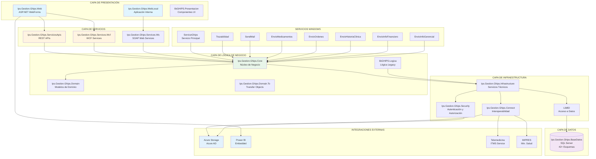
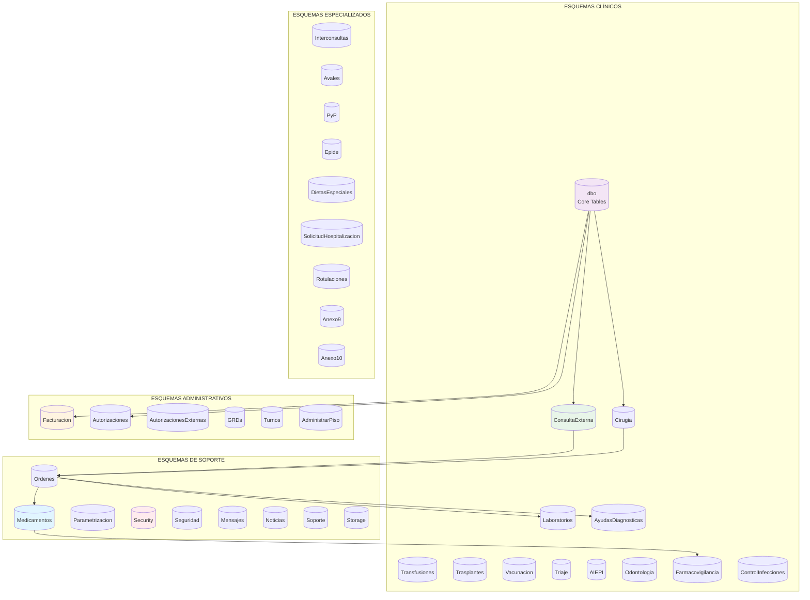
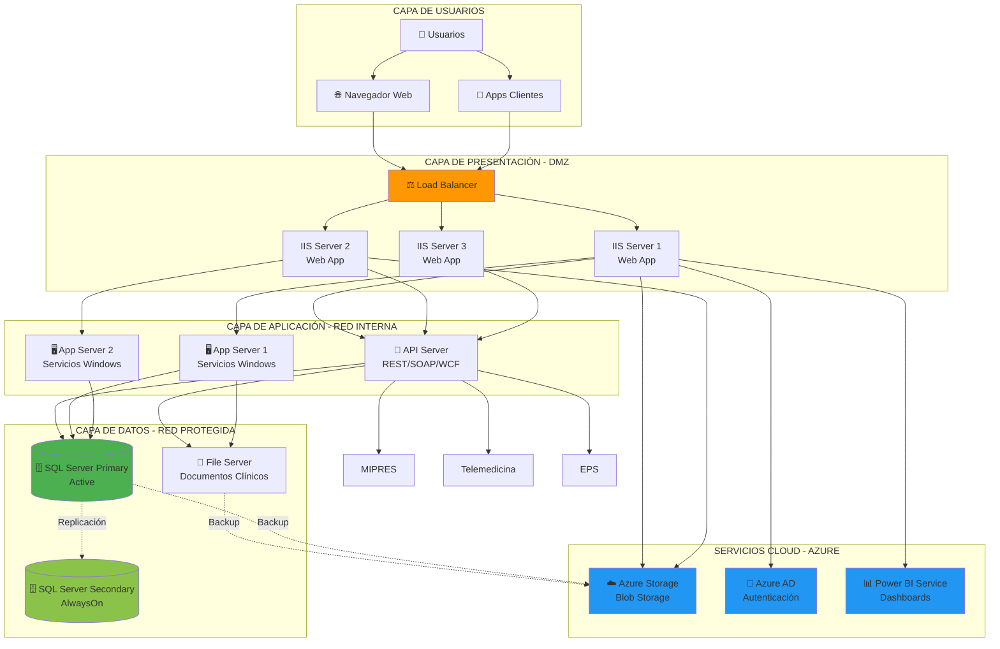
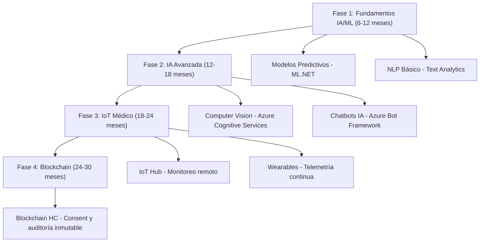

# ARQUITECTURA DEL EMR GHIPS
## Visión integral de componentes, datos, analítica y capacidades emergentes

**Fecha:** 10 de noviembre de 2025  
**Sistema:** GHIPS - Gestión Hospitalaria Integral de Procesos de Salud  
**Tipo:** Electronic Medical Record (EMR) / Sistema de Información Hospitalaria

---

> Desarrollado por el GRUPO DESARROLLO GHIPS. GHIPS es una marca registrada. © 2025 GRUPO DESARROLLO GHIPS. Todos los derechos reservados.

## 1. ARQUITECTURA Y COMPONENTES DE APLICACIÓN DEL EMR

### 1.1 Diagrama de Arquitectura General

### 1.2 Componentes y responsabilidades

- Presentación: WebForms + componentes compartidos (libGHIPS.Presentacion).
- Servicios: REST (Web API), WCF y SOAP/ASMX para interoperabilidad.
- Negocio: Core + Logica (legacy) con DTOs en Domain/Domain.To.
- Infraestructura: Security, Connect y LibBD.
- Datos: SQL Server con 42+ esquemas clínicos, administrativos y de soporte.
- Automatización: 8+ servicios Windows para batch y trazabilidad.

---

## 2. DOCUMENTACIÓN TÉCNICA DE LA SOLUCIÓN

- Patrón: N-Tier + SOA con DI (Unity 5.11.7).
- Patrones: Repository, Service Layer, DTO, Factory, Dependency Injection.
- Configuración por ambiente: Debug/Release/Review/Testing/Integracion + tenants SaaS (Genezen, Imeco, Uroclin, Promedan, Asuncion) y on-premise (Abaton, AlmaMater, ClinicaNorte, SantaAna, Tesoro, Urogine).
- Logging y Caching: Enterprise Library 5.0.414.0.

---

## 3. ESPECIFICACIÓN DE FRAMEWORKS, LENGUAJES Y LIBRERÍAS UTILIZADAS

### 3.1 Lenguajes
- C# (.NET Framework 4.5.2 - 4.6.1)
- JavaScript (jQuery 1.10.2), Knockout.js 3.2.0
- SQL/T-SQL, HTML5/CSS3

### 3.2 Backend .NET
- ASP.NET WebForms, ASP.NET Web API, WCF
- Entity Framework (implícito), Enterprise Library (Logging, Caching, Data)
- OWIN (4.0.1), SignalR (2.2.2 / 2.4.3)

### 3.3 Frontend
- AJAX Control Toolkit 17.1.0.0, Kendo UI Web 2014.1.318
- jQuery UI 1.11.1, jQuery Validation 1.13.0
- Bootstrap 3.2.0.1, Modernizr 2.8.3, Chosen 1.2.0

### 3.4 Documentos y Exportación
- EPPlus 7.0.10, ClosedXML 0.95.4
- iTextSharp 4.1.2, Select.Pdf 18.3.0, PDFsharp/MigraDoc 1.50.5147
- DocumentFormat.OpenXml 2.16.0

### 3.5 Integración y Utilidades
- RestSharp 106.11.7, Newtonsoft.Json 10.0.2
- WindowsAzure.Storage 2.1.0.3, Azure Configuration Manager 1.8.0.0
- Microsoft.Data.OData 5.2.0, ADAL 2.28.4
- AutoMapper 4.1.1, QRCoder 1.4.1, HtmlAgilityPack 1.4.9.5, Ionic.Zip

---

## 4. ARQUITECTURA Y MODELO DE DATOS

### 4.1 Diagrama del Modelo de Datos

### 4.2 Estrategia de Datos
- Motor: SQL Server 2012+ con collation SQL_Latin1_General_CP1_CI_AS.
- Enfoque: Database-first, normalizado por módulos; 42+ esquemas.
- Acceso a datos: ADO.NET + Enterprise Library Data; transacciones distribuidas; pooling (max 200 conexiones).
- Auditoría y caché: Enterprise Library Logging/Caching.

---

## 5. HERRAMIENTAS O MÓDULOS DE ANALÍTICA INCLUIDOS

### 5.1 BI y Dashboards
- Power BI Embedded (powerbi.js) para dashboards interactivos y KPIs.
- Kendo UI Charts y Chart.js 3.7.1 para visualizaciones en la web.

### 5.2 Reportería
- 1354+ reportes RDLC (LocalReport) con reportviewer.
- Generación de PDF/Excel con librerías de documentos.

### 5.3 Módulos de análisis
- Servicios Windows de Información Gerencial y Financiera.
- Esquema Epide para indicadores epidemiológicos y de calidad (IAAS, farmacovigilancia).

---

## 6. INDICADORES Y MÉTRICAS (MONITOREO, CAPACIDAD, DESEMPEÑO, CALIDAD Y UTILIZACIÓN)

- Disponibilidad: Web 99.5%, BD 99.9%, servicios críticos 99.5%.
- Desempeño: latencia API P95 < 500 ms; SignalR < 300 ms; batch RIPS < 120 min.
- Capacidad: CPU App < 70%; uso pool SQL < 75%; caché hit > 80%.
- Calidad clínica: tiempos de atención, ocupación de camas, productividad quirúrgica, eventos adversos.
- Utilización: usuarios activos por módulo, órdenes/día, reportes ejecutados/día, PDFs generados/día.

---

## 7. ARQUITECTURA TÉCNICA Y AMBIENTES REQUERIDOS

### 7.1 Diagrama de Despliegue

### 7.2 Especificaciones Técnicas
- Web/App: Windows Server 2012 R2+, IIS 8.5+, .NET 4.5.2-4.6.1, WebSockets, compresión dinámica.
- BD: SQL Server 2012+ (Standard/Enterprise), Agent, FTS, SSRS; RAM 16-32+ GB, SSD para logs/tempdb.
- Servicios Windows: reinicio automático, scheduler; MSMQ opcional.
- Storage: File Server y/o Azure Storage para documentos clínicos y backups.

---

## 8. INDICADORES ADICIONALES (DISPONIBILIDAD Y UTILIZACIÓN)

- Logging de disponibilidad: inicio/detención de servicios, excepciones, timeouts.
- Servicios Windows: estado, reintentos, Event Viewer.
- Métricas DB: tiempos de consulta, bloqueos/deadlocks, crecimiento de archivos, fragmentación de índices.
- Recursos: CPU, RAM, disco, red, IOPS.

---

## 9. CAPACIDADES EN DESARROLLO, AUTOMATIZACIÓN, ANALÍTICA AVANZADA, IA E IoT DISPONIBLES

- Realtime: SignalR para notificaciones y potencial IoT.
- Cloud: Azure Storage, Azure AD; preparación para Application Insights.
- Automatización: 8+ servicios Windows (EnvioMedicamentos, EnvioOrdenes, SendMail, etc.).
- Analítica: Power BI Embedded, OData, exportación Excel/PDF.
- IA/IoT potencial: integración con Azure Cognitive Services, ML, IoT Hub, Event Hubs, Stream Analytics.

---

## 10. CASOS DE USO IMPLEMENTADOS O PLANIFICADOS CON TECNOLOGÍAS EMERGENTES

### 10.1 Implementados
- Power BI embebido (dashboards ejecutivos).  
- SignalR (notificaciones en tiempo real, chat, alertas clínicas).  
- Azure Storage (almacenamiento híbrido de documentos clínicos).  
- Telemedicina (integración ITMS vía SOAP).  
- Reportes regulatorios automáticos (RIPS, Anexos 9/10).  
- SSO con Azure AD (MFA opcional).  
- Trazabilidad de medicamentos con QR.

### 10.2 Planificados / Roadmap

---

**Documento generado:** 10/11/2025  
**Versión:** 1.0  
**Responsable:** Oficina de Arquitectura y Operaciones GHIPS  
© 2025 GRUPO DESARROLLO GHIPS. Todos los derechos reservados.
