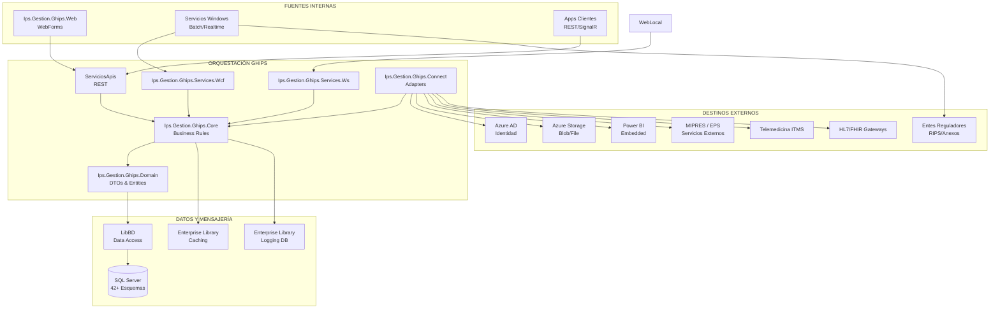

# INTEROPERABILIDAD CLÍNICA Y ADMINISTRATIVA - EMR GHIPS
[[ _TOC_ ]]
## Visión integral de intercambio de información y monitoreo

**Fecha:** Noviembre de 2025  
**Sistema:** GHIPS - Gestión Hospitalaria Integral de Procesos de Salud  
**Enfoque:** Integración clínica, administrativa y ecosistema externo

---

> Desarrollado por el GRUPO DESARROLLO GHIPS. GHIPS es una marca registrada. © 2025 GRUPO DESARROLLO GHIPS. Todos los derechos reservados.

Diagramas
Todos los documentos incluyen diagramas Mermaid que pueden visualizarse:

En VS Code: Instalar extensión "Markdown Preview Mermaid Support"
En Navegador: https://mermaid.live  (copiar y pegar código)
En GitHub: Los archivos .md renderizan Mermaid automáticamente

## 1. ARQUITECTURA Y FLUJOS DE INFORMACIÓN

### 1.1 Modelo de Interoperabilidad

### 1.2 Flujos de Datos Clave

- **Atención clínica en línea:** Captura en `Ips.Gestion.Ghips.Web`, validación en Core, persistencia en esquemas clínicos y difusión hacia módulos de laboratorio, imágenes y farmacia mediante servicios internos.
- **Procesos administrativos:** Generación de autorizaciones, órdenes y facturación desde módulos administrativos, con sincronización a servicios externos (EPS, aseguradoras) vía conectores SOAP/REST.
- **Reportes regulatorios:** Servicios Windows programados exportan datos normalizados hacia RIPS y anexos (9/10) utilizando paquetes RDLC + EPPlus.
- **Analítica y dashboards:** Core publica eventos hacia Power BI Embedded y almacenes Azure para habilitar dashboards ejecutivos casi en tiempo real.
- **Telemedicina y terceros:** `Ips.Gestion.Ghips.Connect` transforma datos clínicos a formatos compatibles (XML/JSON HL7/FHIR) para plataformas de telemedicina y ministeriales.

### 1.3 Flujos Asíncronos y Batch

- Servicios Windows (8+) ejecutan tareas nocturnas de sincronización, generando colas internas (Message Queue implícito) para evitar saturación en horas pico.
- Capa de caching reduce lecturas repetitivas durante integraciones masivas.
- Mecanismos de logging y trazabilidad capturan cada evento para auditoría y reprocesamiento.

---

## 2. SERVICIOS Y CAPACIDADES DE INTEGRACIÓN DISPONIBLES

### 2.1 Catálogo de Servicios Internos

- **REST APIs (`Ips.Gestion.Ghips.ServiciosApis`):** Endpoints JSON para consulta de pacientes, órdenes, agendas, inventarios y métricas; autenticación con tokens y soporte CORS.
- **Servicios WCF (`Ips.Gestion.Ghips.Services.Wcf`):** Interfaces SOAP con contratos versionados para interoperar con soluciones legacy internas y clientes Windows.
- **Servicios ASMX/SOAP (`Ips.Gestion.Ghips.Services.Ws`):** Compatible con instituciones que aún consumen XML simple; mapeo a DTOs del dominio.
- **Servicios Windows Batch:** Automatizan exportaciones (RIPS, facturación electrónica), envío de correos, integración de medicamentos y trazabilidad.

### 2.2 Capas de Integración Externa

- **`Ips.Gestion.Ghips.Connect`:** Framework de conectores que encapsula adapters específicos (MIPRES, HL7, telemedicina, Azure AD). Implementa transformación de mensajes, reintentos y monitoreo.
- **OData Feeds:** Exposición de datos para análisis externo controlado (Microsoft.Data.OData 5.2.0).
- **Power BI Embedded:** Integración bidireccional para dashboards y análisis avanzado.
- **Azure Storage & File Services:** Resolución de adjuntos clínicos, respaldos y distribución documental hacia terceros.

### 2.3 Capacidades Técnicas Relevantes

- Unity Container para inyección de dependencias en componentes de integración.
- Enterprise Library Data para acceso multifuente (SQL principal y réplicas).
- RestSharp/Newtonsoft.Json para consumo y serialización de APIs externas.
- QRCoder y servicios de trazabilidad para integraciones con logística de medicamentos.

---

## 3. PROTOCOLOS Y ESTÁNDARES UTILIZADOS

| Dominio | Protocolo / Estándar | Uso en GHIPS | Observaciones |
|---------|----------------------|--------------|---------------|
| Clínico | HL7 v2.x | Intercambio de resultados laboratorio y ADT | Implementado vía conectores dedicados; soporte MLLP/REST.
| Clínico | HL7 CDA | Documentos clínicos estructurados para interoperabilidad regional | Utilizado en exportación de resumen clínico y epicrisis.
| Clínico | FHIR R4 | Integraciones modernas con plataformas SaaS/telemedicina | Recursos Patient, Encounter, Observation; servido mediante endpoints REST autenticados.
| Administrativo | RIPS (Colombia) | Reportes regulatorios | Generación batch en servicios Windows, validación previa a envío.
| Administrativo | Anexo 9 / 10 | Entrega a entes de control | Generación PDF/Excel automatizada.
| Seguridad | OAuth 2.0 + Azure AD | Autenticación federada | Tokens para APIs y aplicaciones móviles.
| Mensajería | REST/JSON, SOAP/XML | Integraciones mixtas | Contratos versionados con documentación XML.
| Otros | OData, CSV seguro | Exposición controlada de datasets | Acceso con políticas de data governance.

---

## 4. INDICADORES Y MÉTRICAS DE MONITOREO, CAPACIDAD Y DESEMPEÑO

### 4.1 Monitoreo Técnico

- **Disponibilidad:** Uptime web (meta 99.5%), servicios Windows (SLA 99.5%), base de datos (99.9%).
- **Eventos:** Enterprise Library Logging registra métricas de severidad, latencias, reintentos y excepciones.
- **Capacidad:** Uso de pooling (200 conexiones), tamaño de caché, sesiones SignalR concurrentes.
- **Desempeño:** Latencia promedio API/WCF, throughput de mensajes HL7/FHIR, tiempos de respuesta de queries críticos.

### 4.2 Métricas Operacionales

- **Flujos clínicos:** Número de órdenes, resultados y notas interoperadas por día; tasa de éxito de envíos HL7/FHIR; reprocesos.
- **Administrativo:** Volumen de autorizaciones tramitadas, ciclos RIPS completados, facturación electrónica emitida.
- **Utilización:** Usuarios concurrentes por módulo, consumo de recursos (CPU, memoria, disco) en servidores de integración.

### 4.3 Alertamiento y Observabilidad

- Dashboards Power BI con KPIs de integración (tiempos de entrega, errores por conector, backlog).
- Alertas automáticas vía SignalR y correo (SendMail) para fallos críticos o SLA en riesgo.
- SQL Server Agent y tareas Windows programan verificaciones de salud y backups.

### 4.4 Calidad y Seguridad

- Métricas de consistencia de datos (validaciones pre-envío, tasa de rechazo externo).
- Auditoría de trazabilidad (ServicioWinTrazabilidad): quién, qué, cuándo sobre transacciones clínicas sensibles.
- Monitoreo de cumplimiento regulatorio (RIPS, anexos) con indicadores de estados (generado, validado, enviado).

---

## 5. ROADMAP Y MEJORAS EN INTEROPERABILIDAD

- **Corto plazo:** Incrementar cobertura FHIR (recursos MedicationRequest, CarePlan), habilitar webhook para eventos clínicos.
- **Mediano plazo:** Integrar Azure Event Hubs para telemetría IoT y stream analytics; incorporar Application Insights.
- **Largo plazo:** Arquitectura basada en microservicios para conectores críticos, incorporación de modelos predictivos para priorizar integraciones y detección temprana de incidentes.

---

## Aviso Legal y Propiedad Intelectual

Este documento y el software descrito forman parte de la propiedad intelectual del **GRUPO DESARROLLO GHIPS**. GHIPS es una **marca registrada**. Queda prohibida su reproducción total o parcial, distribución, ingeniería inversa o divulgación sin autorización escrita. El acceso está restringido a instituciones y usuarios autorizados conforme contratos vigentes.

**Documento generado:** 11/2025  
**Versión:** 1.0  
**Responsable:** Oficina de Arquitectura y Operaciones GHIPS  
© 2025 GHIPS. Todos los derechos reservados.
