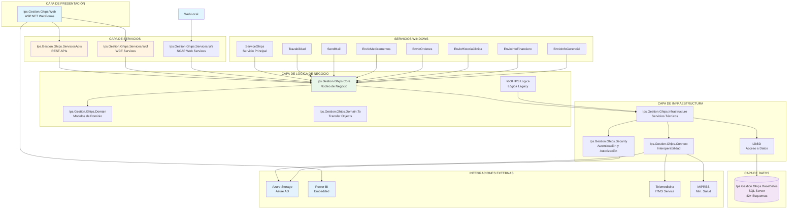
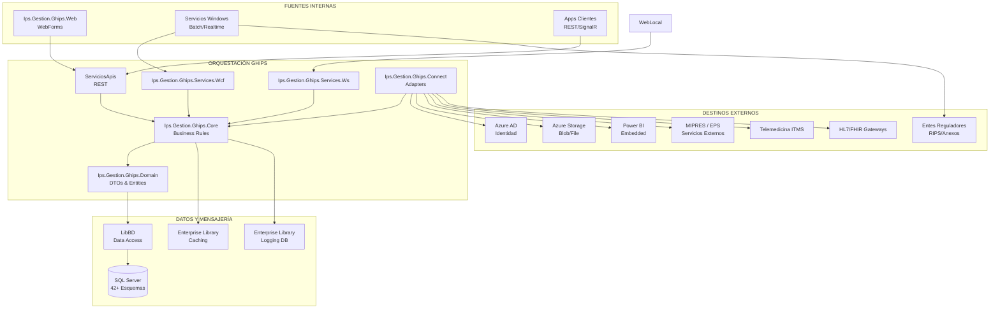
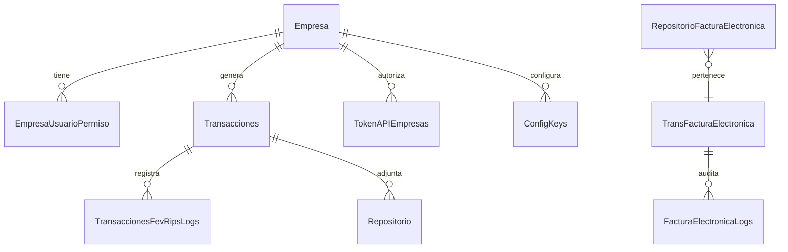
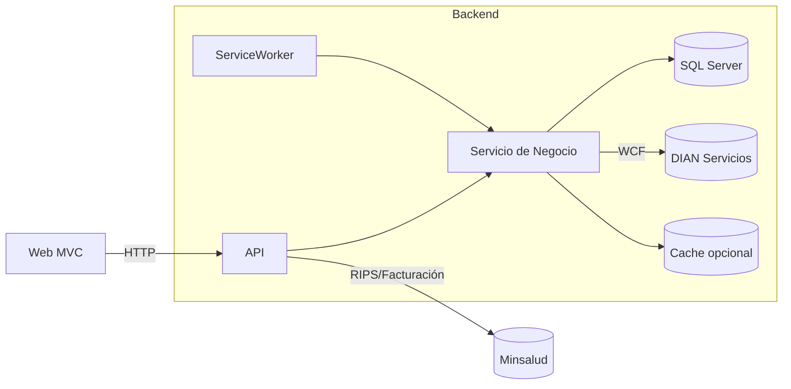
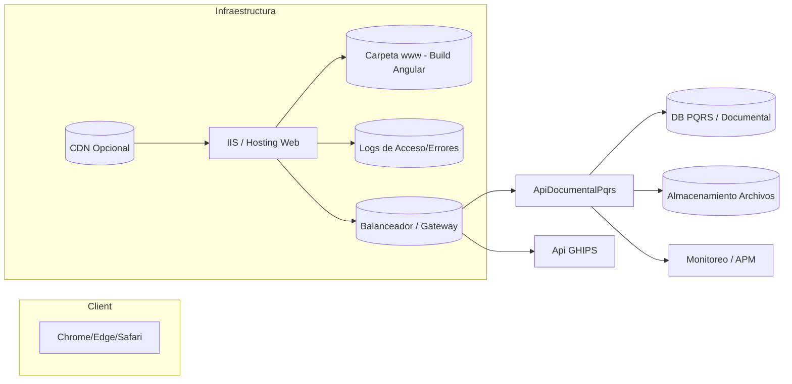

# GHIPS – Respuesta de Auditoría PwC Colombia (Versión Consolidada)

Fecha: 12 de noviembre de 2025
Versión: 1.2
Ámbito: Documento único autoconclusivo para auditoría de PwC Colombia sobre GHIPS como un ERP integral de salud. No incluye referencias externas.

Notas de uso:
- Documento consolidado con 11 frentes. Narrativa unificada como un solo ERP (GHIPS) con módulos clínicos, administrativos y de soporte.
- Se incluyen metas y prácticas recomendadas; las métricas reales de operación deben adjuntarse aparte como evidencia.

## Tabla de Contenido
1. Arquitectura General
2. Arquitectura y Componentes de Aplicación (ERP GHIPS)
3. Documentación Técnica
4. Frameworks, Lenguajes y Librerías
5. Arquitectura y Modelo de Datos
6. Analítica, Reportes y BI
7. Indicadores: Monitoreo, Capacidad, Desempeño, Calidad y Utilización
8. Arquitectura Técnica y Ambientes
9. Indicadores: Disponibilidad y Utilización
10. Capacidades en Desarrollo, Automatización, IA e IoT
11. Casos de Uso con Tecnologías Emergentes
12. Control de Cambios

---

## 1. Arquitectura General

Este bloque resume la arquitectura a nivel corporativo del ERP GHIPS, entendido como una plataforma integral de salud que unifica módulos clínicos, administrativos, financieros y de soporte.

### Resumen
- Estilo: arquitectura multicapa (Presentación, Servicios/APIs, Dominio, Infraestructura, Datos) con orientación a servicios.
- Tecnologías: .NET Framework 4.5–4.8 (EMR/Financiero/Activos), ASP.NET Core/.NET 8 (FevRips), Angular/Ionic (PQRS), SQL Server, SSRS.
- Despliegue: IIS web farm + App Servers + SQL Server (AlwaysOn objetivo), servicios Windows (EMR), contenedores (FevRips), integración con Azure AD/Storage/Power BI.

### Módulos del ERP GHIPS
- Clínico (EMR): WebForms + Web API + WCF/SOAP; núcleo de negocio; 8+ servicios Windows; seguridad y conectividad; base de datos con 42+ esquemas clínicos y administrativos.
- Facturación y RIPS: Servicios web/API y workers para validación y facturación electrónica (UBL/XAdES); soporte de multitenancy; ejecución en contenedores cuando aplica.
- Financiero: ASP.NET MVC 5 + Web API; EF6; +150 reportes SSRS; dominios Contable, Presupuesto, Tesorería y Cartera.
- Activos: ASP.NET MVC/WebForms + API REST; EF y procedimientos almacenados; ETL/CLR; reportes SSRS; logging con NLog/Unity.
- PQRS/Portal: SPA Angular/Ionic para peticiones, quejas, reclamos y sugerencias; consumo de APIs del ERP.
- Interoperabilidad y Conectividad: HL7 v2.x, CDA y FHIR; conectores MIPRES, Telemedicina; SSO con Azure AD; almacenamiento de documentos en Azure Storage; integración con Power BI; OData.

### Diagrama de Arquitectura General

### Modelo de Interoperabilidad

---

## 2. Arquitectura y Componentes de Aplicación (ERP GHIPS)

### Diagrama y capas
- Presentación: Ips.Gestion.Ghips.Web (WebForms)
- Servicios: REST (ServiciosApis), WCF (Services.Wcf), SOAP/ASMX (Services.Ws).
- Negocio: Ips.Gestion.Ghips.Core + libGHIPS.Logica; Domain y DTOs (Domain.To).
- Infraestructura: Infrastructure, Security (authz), Connect (integraciones), LibBD (datos).
- Datos: SQL Server con 42+ esquemas clínicos/administrativos/soporte.
- Automatización: 8+ servicios Windows (ServiceGhips, Trazabilidad, Envio*).

La solución se organiza en capas claramente separadas para favorecer mantenibilidad, escalabilidad y seguridad.

### Módulos funcionales (extracto)
- Clínicos: Consulta externa, Urgencias, Hospitalización, Cirugía, Laboratorios, Ayudas Diagnósticas, Vacunación, Triaje, IAAS, Farmacovigilancia.
- Administrativos: Admisiones, Autorizaciones, Facturación, GRDs, Turnos, Administración de Piso.
- Soporte: Medicamentos, Órdenes, Parametrización, Seguridad, Mensajes/Noticias.
---

## 3. Documentación Técnica

### Patrones y estilo
- N‑Tier + SOA; DI con Unity; Repository/Service Layer/DTO/Factory.
- Caching y Logging corporativos (Enterprise Library).

### Configuración por ambientes
- EMR: Debug/Release/Review/Testing/Integracion + tenants SaaS/on‑prem (14+ variantes).
- Financiero: Dev/QA/Integración/Release/Prod; configuraciones de reportes SSRS.
- FevRips: appsettings por ambiente; docker compose productivo local; TLS en Kestrel.

### Observabilidad
- Logs: Enterprise Library (EMR), NLog (Financiero/FevRips/Activos).
- Recomendado: Application Insights / OpenTelemetry.

---

## 4. Frameworks, Lenguajes y Librerías

### Lenguajes
- C# (.NET Framework 4.5–4.8 y .NET 8 en FevRips)
- JavaScript/TypeScript (Angular/Ionic; jQuery/Knockout en legacy)
- T‑SQL; HTML/CSS

### Backend
- EMR/Financiero/Activos/Documental/Mejoramiento: ASP.NET WebForms/MVC/Web API; WCF/SOAP; Enterprise Library; OWIN; SignalR 2.x.
- FevRips/APIS: ASP.NET Core Web API + Worker; Identity/JWT; EF Core.

### Frontend
- PQRS: Angular 16 + Ionic 7
- EMR/Financiero: jQuery, Kendo UI, Chart.js, Bootstrap.

### Documentos/Exportación
- EPPlus, ClosedXML, iTextSharp/Select.Pdf/PDFsharp.

### Integración y utilidades
- RestSharp, Newtonsoft.Json, Azure Storage/AD libs, AutoMapper, QRCoder, HtmlAgilityPack.
---

## 5. Arquitectura y Modelo de Datos

### EMR (Asistencial)
- Motor: SQL Server 2016+; collation SQL_Latin1_General_CP1_CI_AS.
- Organización: 42+ esquemas por dominios (clínicos, administrativos, soporte, especializados).
- Acceso: ADO.NET + Enterprise Library Data; transacciones; pooling (max 200).

### FevRips
- Multitenancy por TenantId; tablas temporales (SYSTEM_VERSIONED) para auditoría; índices por campos críticos.

### Financiero
- Dominio contable/presupuestal/tesorería/cartera; vistas y tablas precalculadas para reportería; seguridad en BD separada.

### Diagrama ER simplificado (Facturación/RIPS)

---

## 6. Analítica, Reportes y BI

- Clínico: Power BI Embedded (dashboards y KPIs); Kendo/Chart.js; 1354+ reportes RDLC con ReportViewer (exportación PDF/Excel).
- Financiero: +150 reportes SSRS (financieros, contables, tesorería, presupuestales); indicadores de gestión y BSC; medios magnéticos; taxonomía XBRL.
- RIPS/Facturación: Exportes Excel/PDF (ClosedXML/EPPlus/QuestPDF); capacidad de procesamiento por lotes con seguimiento de métricas.
- Activos: Reportes SSRS operacionales (inventario, compras); KPIs de rotación y tiempos de ciclo.

---

## 7. Indicadores: Monitoreo, Capacidad, Desempeño, Calidad y Utilización

### Objetivos (EMR)
- Disponibilidad: Web 99.5%, BD 99.9%.
- Desempeño: API p95 < 500 ms; SignalR < 300 ms; batch RIPS < 120 min.
- Capacidad: CPU App < 70%; Pool SQL < 75%; caché hit > 80%.
- Calidad clínica: tiempos atención, ocupación, productividad, eventos adversos.
- Utilización: usuarios activos por módulo, órdenes/día, reportes/día.

### Evidencias/prácticas
- Enterprise Library Logging (categorías, DB listener); métricas de pool/caché.
- Dashboards Power BI; PerfMon/DMVs; IIS Logs.

---

## 8. Arquitectura Técnica y Ambientes

### Despliegue EMR (on‑prem / híbrido)
- Capa de usuarios → LB → IIS Web Farm → API/App servers → SQL Server (Primary/Secondary AlwaysOn) → File Server.
- Integraciones: Azure Storage/AD/Power BI; MIPRES; Telemedicina.

### Especificaciones
- Web/App: Windows Server 2019+ / IIS 8.5+, .NET 4.5.2–4.6.1, WebSockets, compresión dinámica.
- BD: SQL Server 2019+; Agent/FTS/SSRS; RAM 16–32+ GB; SSD logs/tempdb.
- Servicios Windows: reinicio automático; scheduler.

### Ambientes
- Desarrollo/Review/Testing/Integración/Release + Producción por institución (on‑prem) y SaaS por tenant.
- FevRips: contenedores Docker (API/DB); TLS en Kestrel.

### Despliegue y componentes (RIPS/Facturación)

### Vista técnica del Portal PQRS

---

## 9. Indicadores: Disponibilidad y Utilización

### Disponibilidad
- Uptime web objetivo: 99.5%; BD: 99.9%; Servicios Windows: 99.5%.
- Monitoreo: health checks, Event Viewer, logs de disponibilidad, estado de servicios.

### Utilización
- Usuarios concurrentes por módulo; conexiones SignalR activas; sesiones; uso de endpoints top.
- Volumen: órdenes/día, PDFs/reportes/día, tamaño BD y crecimiento mensual.

### Herramientas
- PerfMon/DMVs; IIS Logs; dashboards Power BI; propuesto Application Insights/OpenTelemetry.

---

## 10. Capacidades en Desarrollo, Automatización, IA e IoT

### Actual
- Automatización: 8+ servicios Windows (EMR); Workers (FevRips); WorkProcess (Financiero).
- Analítica: Power BI Embedded; SSRS/RDLC; exportes Excel/PDF.
- Tiempo real: SignalR (notificaciones, chat, estados).
- Cloud: Azure Storage / Azure AD; OData.

### Roadmap
- IA/ML: modelos predictivos (reingresos, demanda de inventarios), NLP clínico, visión por computador.
- IoT: IoT Hub/Event Hubs; monitoreo remoto/vitales; control ambiental farmacia/lab.
- Observabilidad: App Insights / OpenTelemetry; Prometheus/Grafana.

---

## 11. Casos de Uso con Tecnologías Emergentes

### Implementados
- Dashboards ejecutivos embebidos (Power BI).
- Notificaciones y colaboración en tiempo real (SignalR).
- Telemedicina (ITMS via SOAP) y conectores ministeriales (MIPRES).
- Almacenamiento híbrido de documentos clínicos (Azure Storage); SSO con Azure AD.
- Facturación electrónica (FevRips/Financiero; UBL/XAdES; DIAN).
- Trazabilidad con QR de medicamentos.

### Planificados / Roadmap
- ML predictivo (reingresos, demanda, sepsis temprana).
- NLP clínico (text analytics; clasificación SNOMED-CT).
- IoT médico (monitoreo remoto; wearables; telemetría en tiempo real).
- Computer Vision en imágenes médicas.
- Blockchain para consentimientos y auditoría inmutable.

---

## Control de Cambios

- 2025-11-12 (v1.2): Se incorporaron diagramas oficiales (Mermaid) de arquitectura general, interoperabilidad, ER de RIPS y vistas técnicas de despliegue.
- 2025-11-12 (v1.1): Versión unificada sin referencias externas. Narrativa integrada como un solo ERP (GHIPS) y ajuste de tabla de contenidos.
- 2025-11-12 (v1.0): Primera edición consolidada para Auditoría PwC Colombia.
