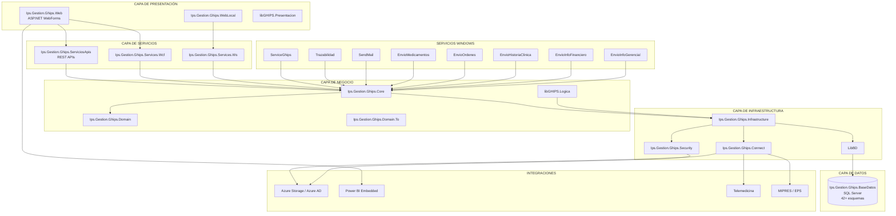

# Arquitectura y Componentes de Aplicación del EMR GHIPS
[[ _TOC_ ]]

Fecha: 12/11/2025

## Visión general
El EMR GHIPS es una plataforma N‑capa con servicios REST/WCF/SOAP, núcleo de negocio central y base de datos SQL Server con más de 42 esquemas clínicos y administrativos. Incluye servicios Windows para procesos batch y trazabilidad, además de integraciones con Azure AD, Azure Storage, Power BI y plataformas externas (telemedicina, MIPRES, EPS).

## Diagrama lógico (alto nivel)

## Componentes y responsabilidades
- Presentación: WebForms y librería de UI compartida.
- Servicios: REST (Web API), WCF y ASMX/SOAP para compatibilidad.
- Negocio: Core y lógica legacy con DTOs de dominio.
- Infraestructura: seguridad, conectores e infraestructura técnica.
- Datos: SQL Server con esquemas clínicos/administrativos/soporte.
- Automatización: servicios Windows para procesos y reportes.

Fuente base: `Asistencial/Documentacion_Arquitectura_General_GHIPS_EMR.md`.