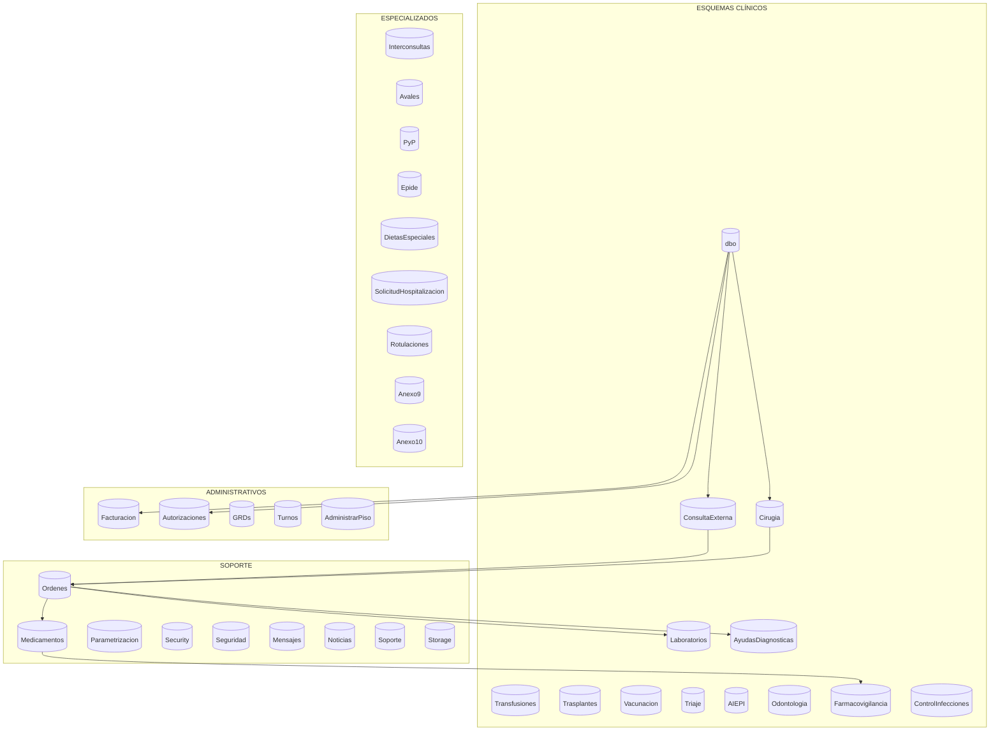

# Arquitectura y Modelo de Datos
[[ _TOC_ ]]

Fecha: 12/11/2025

## Estrategia
- Motor: SQL Server 2012+ (recomendado ≥ 2016) con collation SQL_Latin1_General_CP1_CI_AS.
- Database‑first con 42+ esquemas clínicos, administrativos, soporte y especializados.
- Acceso: ADO.NET + Enterprise Library Data; uso de procedimientos y pooling (≈200 conexiones máximas).
- Auditoría y caché con Enterprise Library.

## Vista de esquemas (conceptual)

## Consideraciones adicionales
- Integridad referencial, índices por alta cardinalidad y optimización de consultas.
- Estrategias de retención/archivado definidas por DBA. 

Fuentes: `Asistencial/Documentacion_Arquitectura_General_GHIPS_EMR.md`, `Activos/datos.md`.