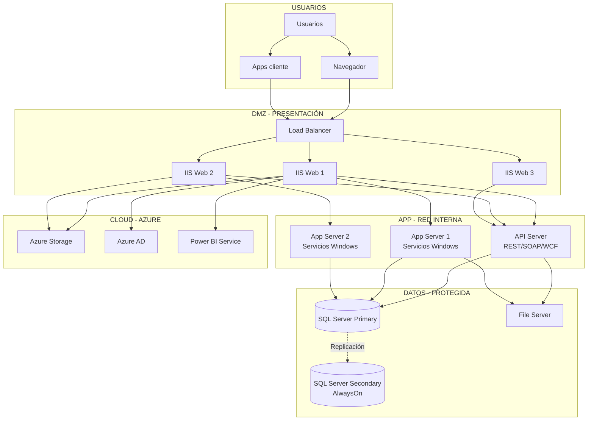

# Arquitectura Técnica y Ambientes Requeridos

Fecha: 12/11/2025

## Diagrama de despliegue (referencial)

## Ambientes
- Desarrollo, Integración/Testing, Release/Preprod, Producción.

## Requisitos técnicos
- Web/App: Windows Server 2012 R2+ / IIS 8.5+ / .NET 4.5.2–4.6.1, WebSockets, compresión.
- BD: SQL Server 2012+ (Standard/Enterprise), Agent, FTS, SSRS; RAM 16–32+ GB; SSD para logs/tempdb.
- Servicios Windows: recuperación automática y scheduler.
- Storage: File Server y/o Azure Storage para documentos y backups.

## Seguridad de red
- TLS 1.2; segmentación por VLAN; WAF recomendado; CORS restringido.

Fuentes: `Asistencial/Documentacion_Arquitectura_General_GHIPS_EMR.md`, `Activos/ambientes.md`.