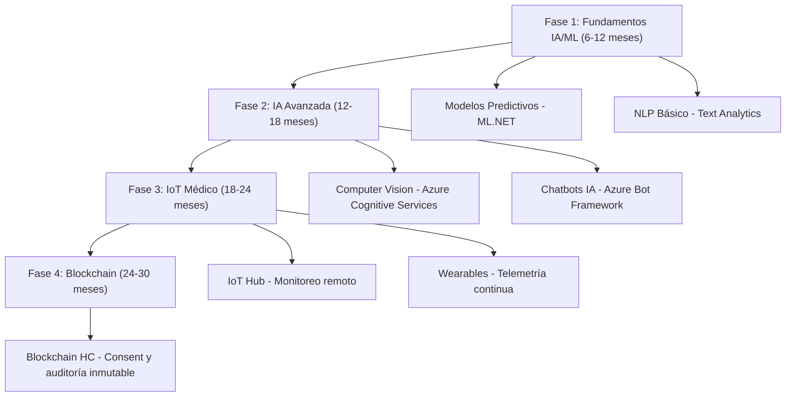

# Casos de Uso con Tecnologías Emergentes (Implementados y Planificados)
[[ _TOC_ ]]

Fecha: 12/11/2025

## Implementados
- Power BI embebido: tableros ejecutivos y operacionales.
- SignalR: notificaciones en tiempo real (alertas clínicas, chat, estado de órdenes).
- Azure Storage: almacenamiento híbrido de documentos clínicos.
- Telemedicina: integración ITMS vía SOAP/REST.
- Reportes regulatorios automáticos: RIPS, Anexos 9/10.
- SSO con Azure AD (MFA opcional) y trazabilidad con QR.

## Planificados (Roadmap)

Fuentes: `Asistencial/Documentacion_Arquitectura_General_GHIPS_EMR.md`.