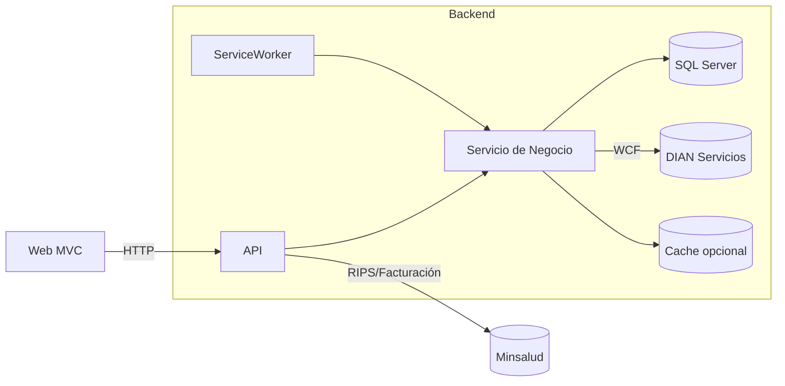

# Arquitectura y componentes

Este documento resume la arquitectura técnica de FevRips (EMR/Facturación y RIPS) y sus componentes.

## Visión general

FevRips es una solución .NET 8 modular con separación por capas y componentes:

- Web (ASP.NET Core MVC + Identity) — Portal administrativo y UI para gestión de empresas, transacciones, RIPS y facturación.
- API (ASP.NET Core Web API) — Servicios REST para autenticación, transacciones y reportes RIPS; Swagger habilitable por configuración.
- Service/Core — Capa de negocio, integración (DIAN/WCF), firmas (XAdES), generación de documentos (PDF/Excel), helpers.
- Data — Acceso a datos con EF Core/SQL Server, multitenancy por TenantId, tablas temporales e índices.
- Domain/Domain.To — Entidades, DTOs, serializadores y contratos de dominio.
- ServiceWorker — Trabajos en segundo plano (HostedService/Queue) para procesamiento asíncrono (cargas RIPS, envíos, tareas programadas).

## Componentes clave

- ASP.NET Core Identity + Roles: autenticación y autorización.
- Multitenancy: filtro global por TenantId aplicado en DbContext; validaciones para exigir etiquetado de entidades tenant.
- Persistencia: SQL Server 2022, tablas temporales para auditoría (SYSTEM_VERSIONED), índices por campos de consulta.
- Observabilidad: NLog; puntos de integración para métricas y trazas.
- Documentación API: Swagger/OpenAPI (opcional por `Security:EnabledSwagger`).
- Seguridad de transporte: HTTPS/Kestrel, soporte de certificado PFX en despliegues Docker.

## Flujos principales

1. Carga/validación RIPS: UI o API -> cola de tareas -> procesamiento Core -> persistencia -> reporte.
2. Facturación electrónica: Core -> generación UBL/firmado XAdES -> validación/registro DIAN -> almacenamiento e historización.
3. Reportería RIPS: API -> consultas parametrizadas e índices por TenantId, Transacción, Fechas -> exportación (Excel/PDF).

## Despliegue y contenedores

- SQL Server 2022 (Docker) con límites de CPU/memoria, collation `SQL_Latin1_General_CP1_CI_AS`.
- API dockerizada con certificado montado vía volumen en Kestrel (`/certificates`).
- Red docker bridge para comunicación interna.

Véase `apilocal-dockercompose.Production.yml` para detalles de recursos, variables y puertos.
