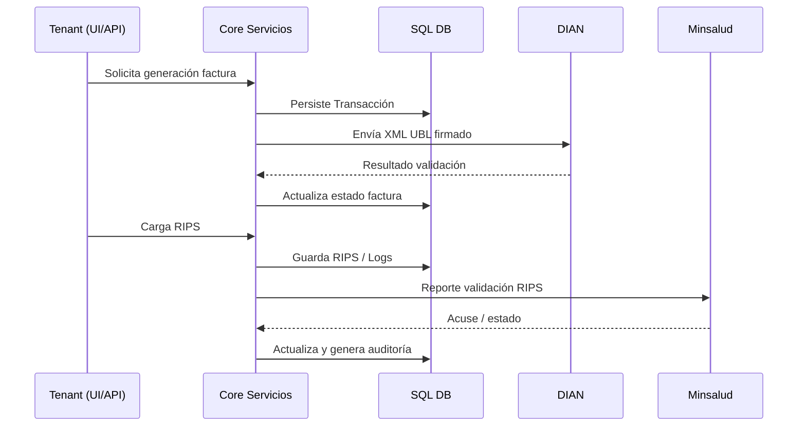

# Interoperabilidad clínica y administrativa

## Servicios y capacidades de integración
- API REST (ASP.NET Core) para autenticación, transacciones, reportes RIPS.
- Integraciones externas: DIAN (facturación electrónica), Minsalud (reportes RIPS) vía endpoints configurados en `Configuraciones`.
- Tokens por empresa (`TokenAPIEmpresas`) para autorización de invocaciones a servicios asistenciales.

## Protocolos actuales
- HTTP/HTTPS + JSON (REST).
- JWT para autenticación (tokens Oauth internos `Security:KeyOauth`).
- WCF (System.ServiceModel.*) para ciertos servicios DIAN.
- UBL 2.1 XML para facturación electrónica (XSD en `Services\XSD`).

## Protocolos potenciales (futuros)
- HL7 FHIR para interoperabilidad clínica ampliada.
- Webhooks para eventos (factura validada, RIPS procesado).

## Flujos de información (alto nivel)

## Métricas de integración propuestas
- Latencia promedio de validación DIAN.
- Tasa de errores por servicio externo.
- Reintentos vs éxitos (WCF/HTTP).
- Tiempo de ciclo RIPS (carga -> validación -> confirmación).

## Consideraciones de seguridad
- Aislamiento por Tenant en queries y tokens.
- Firma digital XAdES garantiza integridad de factura.
- HTTPS obligatorio para tráfico externo.
