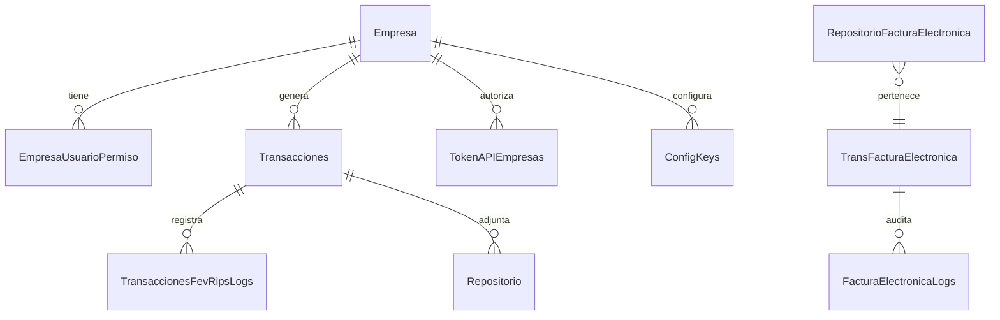

# Arquitectura y Modelo de Datos

## Enfoque general
El modelo de datos soporta multitenancy (columna `TenantId` en entidades marcadas) y trazabilidad temporal mediante tablas temporales (SYSTEM_VERSIONED) configuradas en `OnModelCreating`.

## Principales entidades
- Empresa / Vinculacion / EmpresaUsuarioPermiso: gestión de organizaciones y permisos.
- User (Identity): autenticación, perfiles y roles.
- Transacciones / TransFacturaElectronica / NotasTransacciones / NotasFacturaElectronica: núcleo de facturación y notas crédito/débito.
- Repositorio / RepositorioFacturaElectronica / NotasRepositorioElectronica: almacenamiento de artefactos (XML UBL, documentos firmados, logs, anexos).
- FacturaElectronicaLogs / TransaccionesFevRipsLogs / Loggin: auditoría y seguimiento de procesos.
- ConfigKeys / TokenAPIEmpresas: configuración dinámica y tokens de integración.
- Pais / Estado / Firma: datos referenciales y firma digital.

## Multitenancy
Se aplica filtro global por Tenant en cada entidad que implementa `IEntidadTenant`. Cualquier entidad que no implemente la interfaz y sea tenant-dependiente genera excepción para asegurar consistencia.

## Indexación y rendimiento
Indices definidos en:
- Transacciones: `NumeroFactura`, `NumeroFacturaMesA`, `Eliminado`.
- TransaccionesFevRipsLogs: `TenantId`, `TransaccionId`, `RepositorioId`, `FechaRegistro`.
- Repositorio / RepositorioFacturaElectronica: `TenantId`, `TransaccionId`, `FacturaElectronicaId`.
- FacturaElectronicaLogs: `FacturaElectronicaId`, `TenantId`.
- Notas / Facturas: índices por campos críticos de búsqueda y correlación.

## Temporal Tables
Las tablas marcadas con `opciones.IsTemporal()` permiten:
- Auditoría de cambios históricos.
- Posible reconstrucción de estados previos para validaciones regulatorias.

## Consideraciones futuras
- Consolidar migraciones EF Core (proyecto Data único vs API/Web).
- Ajustar tipos para escalabilidad (GUID vs string para TenantId si aplica).
- Revisión de convenciones de borrado lógico (`Eliminado`) y políticas de retención.
