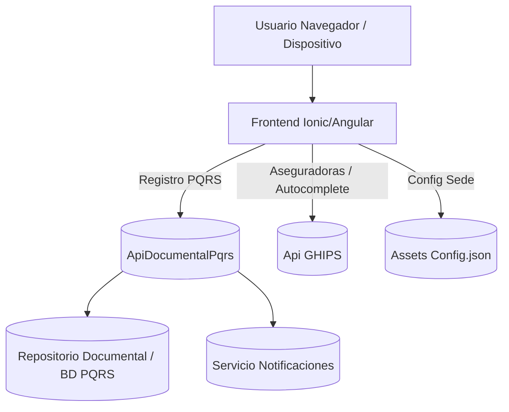
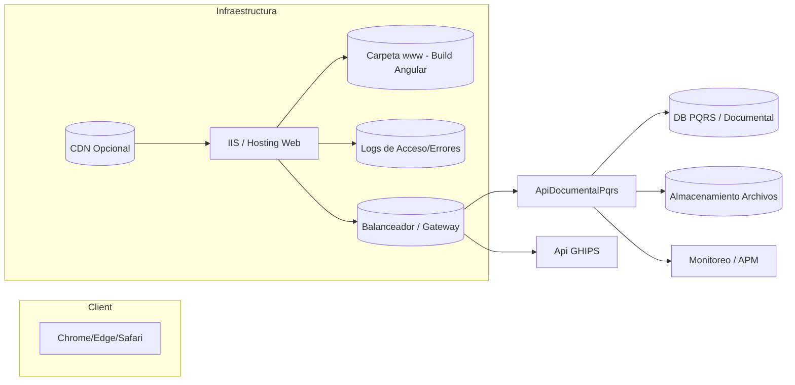
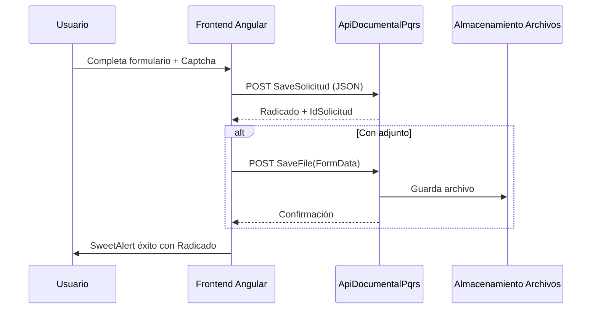
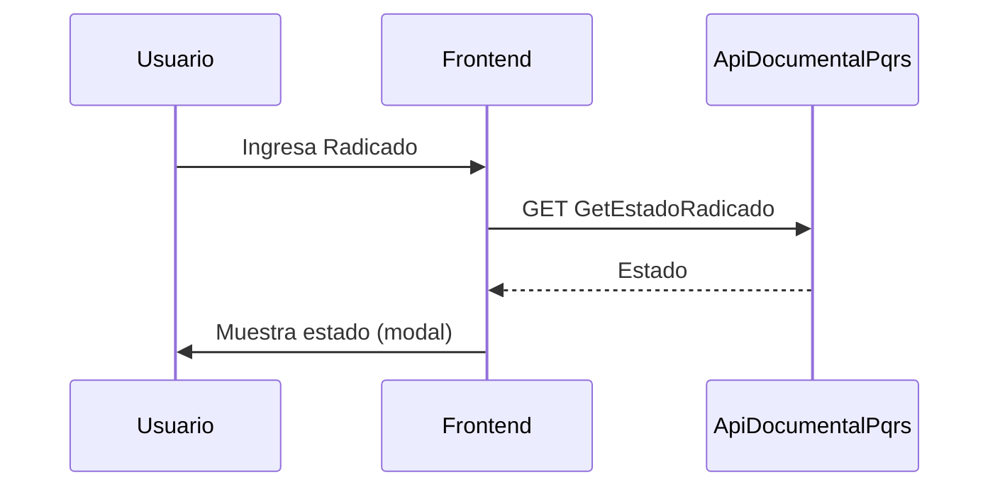
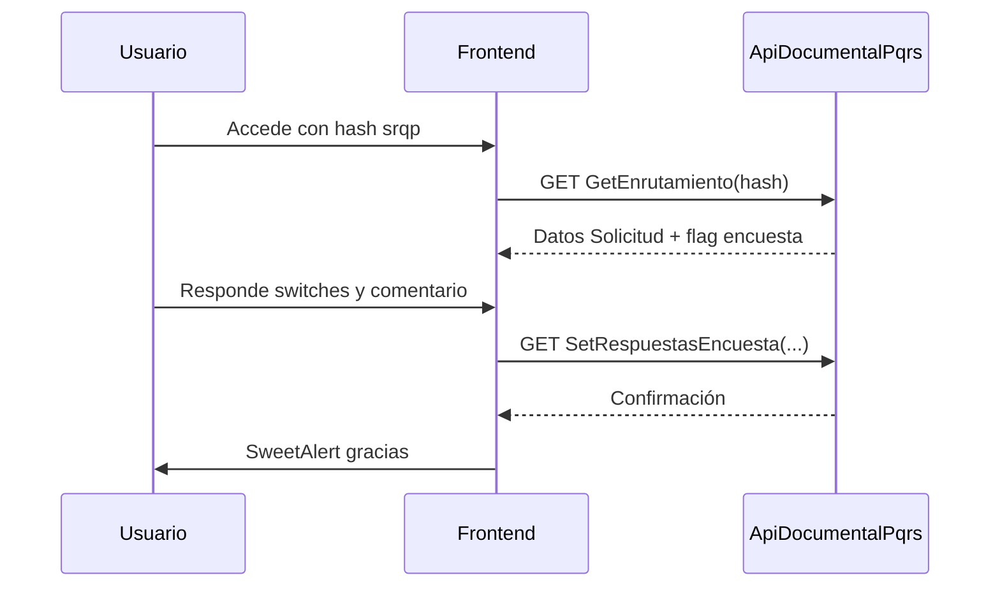
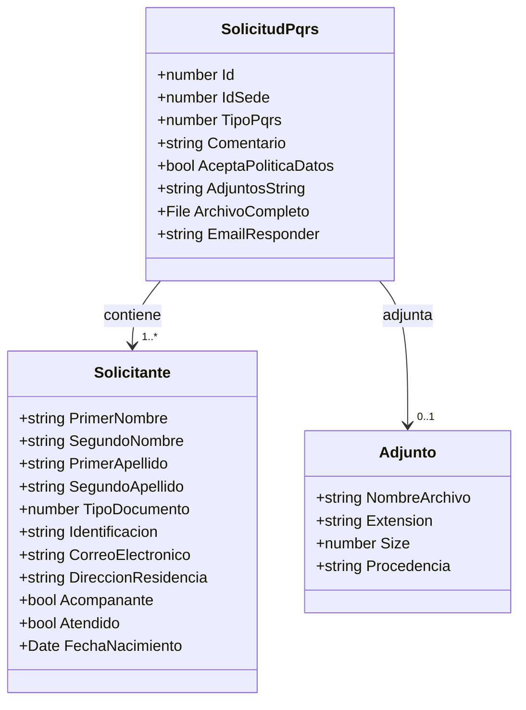

# Diagramas de Arquitectura – Gestión PQR

Este documento provee diagramas (Mermaid) para soportar auditoría: vista lógica, vista técnica y flujo de datos principal.

## 1. Vista Lógica de Componentes

## 2. Vista Técnica / Despliegue

## 3. Flujo de Registro PQRS

## 4. Flujo de Consulta Estado

## 5. Flujo de Encuesta de Satisfacción

## 6. Diagrama Simplificado de Datos

## 7. Notas y Suposiciones
- Backend maneja validaciones adicionales, seguridad avanzada y persistencia.
- El captcha actual es sólo cliente; recomendable validación server-side o reCAPTCHA.
- SetRespuestasEncuesta debería ser POST para mayor semántica y seguridad (evitar datos sensibles en URL).

## 8. Próximas Mejoras (Diagramas)
- Añadir diagrama de secuencia para manejo de errores (HTTP 4xx/5xx).
- Diagrama de despliegue extendido con zonas/replicas y CDN.
- Diagramas de proceso para pipeline CI/CD y blue/green.

---
Fin de los diagramas.
